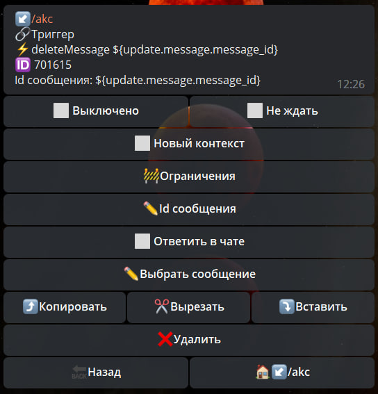

# deleteMessage

**deleteMessage** — реакция позволяет удалить любое сообщение. 



Можно удалить пост по 📅 расписанию, или по 🚧 условию, например, как только количество голосов станет равным заданному. Для удаления конкретного сообщения, необходимо указать ID этого сообщения.

---

Для удаления сообщения в личных чатах с ботом, необходимо настроить следующие реакции:

**takeUsers** — указать юзера или путь до ID юзера в формате ```${...}```

— **deleteMessage** — указать путь до ID сообщения в формате ```${...}```

---

Для автоматического удаления сообщения в группе/канале, необходимо настроить следующие реакции:

**takeChat** — ```${chat.id}```

— **deleteMessage**

---

Для ручного удаления сообщения в любой сущности, необходимо настроить следующие реакции:

**takeChat** — указать чат или путь до ID чата в формате ```${...}```

— **deleteMessage** — указать путь до ID сообщения в формате ```${...}```


::: tip Особенности

* Можно удалить сообщение отправленное не позднее последних 48 часов

* реакция полноценно работает вместе с макросом [profile](/ext/macros/profile/)

:::


