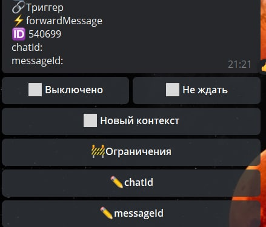

# forwardMessage

**forwardMessage** — пересылка исходного сообщения в указанный чат.

**chatid** - позволяет указать какое сообщение необходимо пересылать

**messageid** - позволяет указать чат откуда брать сообщение