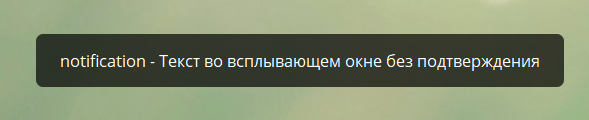

# notification

**notification** - Текст во всплывающем окне без подтверждения. 

::: tip  Особенности
* Лимит символов - 200
* Вызывается только при нажатии на кнопку
* Нельзя вызвать с помощью Телеграм клавиатуры
* Может содержать макросы и переменные, но не ссылки
* Если установить 2 notification в реакции, сработает только первый.
::: 

[bot.api method - answerCallbackQuery](https://core.telegram.org/bots/api#answercallbackquery)

