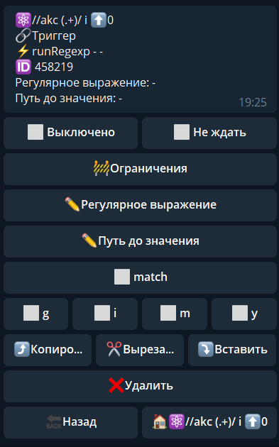

## runRegexp
**runRegexp** — реакция найдет в указанной строке все подстроки, удовлетворяющие установленному регулярному выражению.

**Регулярное выражение** - здесь необходимо написать ваше регулярное выражения без использования косых черт (//) и параметров. 

Разберем на примере

Ваша регулярка выглядит так: /спасибо|спс|лайк/i

В реакции надо добавить регулярку в следующем формате: спасибо|спс|лайк

**Путь до значения** - по умолчанию, то что пишут в чате, находится по пути: ${update.message.text}. Можно указывать любой путь, который вам необходимо проверять.

Опция ☑️ **match**, Позволяет искать не только первое совпадение в тексте, но и все совпадения в тексте, и помещает всё найденное в переменную: ${regexpResult.list}

**Параметры (флаги):**

`g -` глобальное сопоставление

`i-` игнорирование регистра при сопоставлении

`m -` сопоставление по нескольким строкам; символы начала и конца (^ и $) начинают работать по нескольким строкам (то есть, происходит сопоставление с началом или концом _каждой_ строки (строки разделяются символами \n или \r), а не только с началом или концом всей вводимой строки)

`y`  - «липкий» поиск; сопоставление в целевой строке начинается с индекса, на который указывает свойство `lastIndex` этого регулярного выражения (и не пытается сопоставиться с любого более позднего индекса).

Более подробно можно изучить здесь: 

[Ссылка](https://developer.mozilla.org/ru/docs/Web/JavaScript/Reference/Global_Objects/RegExp#parameters)

