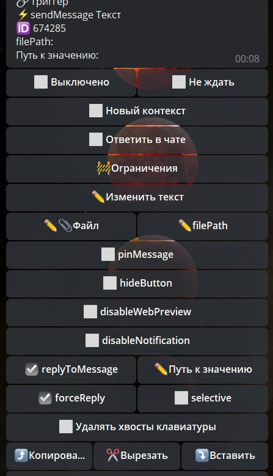

# sendMessage

**sendMessage** — реакция отправит текстовое сообщение. Сообщение отправляется в приват с ботом, если реакция не вложена в take-реакцию, которая указывает направление вывода.

Например:
```plain
sendMessage — сообщение в личку с ботом
```
```plain
takeChat — выбрать чат
— sendMessage — сообщение в выбранный чат
```

При создании реакции можно добавить файл. Если в качестве файла использовать изображение, то оно будет размещено над текстом. В качестве файла можно использовать стикер, но в этом случае текст сообщения будет скрыт (недоступен).


В настройках реакции доступны следующие функции:



| Функция | Описание |
| --- | --- |
| **Файл / filePath** | Позволяет отправлять медиа. |
| **Ответить в чате** | При включении, направление вывода сообщения может измениться с бота на чат, если реакция будет выполняться в чате. |
| **pinMessage** | Закрепляет отправленное сообщение, аналогична реакции pin. |
| **hideButton** | Добавит к сообщению кнопку скрыть пост. Кнопка будет доступна на протяжении 48 часов. |
| **disableWebPreview** | Отключит предпросмотр ссылок содержащихся в сообщении. |
| **disableNotification** | Отключит оповещение о новом сообщении. |
| **replyToMessage** | Сообщение отправляется в ответ на сообщение запустившее триггер |
| **Путь к значению** | Позволяет указать переменную с message_id, где будет указано сообщение на которое необходимо ответить. |
| **forceReply** | Принудительный реплай на отправленное сообщение |
| **selective** | Используйте этот параметр, если хотите удалить клавиатуру только для определенных пользователей. Цели: 1) пользователи, @упомянутые в тексте объекта « Сообщение » ; 2) если сообщение бота является ответом (имеет response_to_message_id ), отправитель исходного сообщения. |
| **Удалять хвосты** | Результаты этих реакций будут удалены при входе в другой раздел клавиатуры.  |

Можно указать путь до message где лежит любой файл, например, чтобы переслать файл на который сделали reply, укажите следующий путь:

```${update.message.reply_to_message}``` или ```${update.message}``` - если нужно отловить просто отправленное медиа

А можно указать путь до объекта который хранит в себе параметры fileId и type. Поле type должно иметь одно из значений:
```plain
🔸photo
🔸audio
🔸video
🔸video_note
🔸animation
🔸document
🔸voice
🔸sticker
```
по умолчанию реакция возьмет фото с максимальным размеров, если тебе например надо взять другой размер, тогда нужно создать в локальных переменных объект который содержит fileId и type = photo

**Как это сделать?**
```plain
1) localVarSet file.fileId = ${путь до file_id} 
**Галочка Собрать объект**
2) localVarSet file.type = photo 
**Галочка Собрать объект**
а потом указывам путь:
${localVar.file}
```

Реакция может показывать файлы, полученные в процессе выполнения реакции, с помощью макроса: ```!{attach| path: Путь}```, где Путь - это местоположение файла.


Например: после реакции exportToExcel, файл будет доступен в переменной: ```${exports.votes}``` или ```${exports.form}``` (для голосований или формы соответственно). Чтобы прислать экспортированный файл, можно воспользоваться реакцией sendMessage с текстом: ```!{attach| path: exports.votes}``` или ```!{attach| path: exports.form}```


::: tip  Особенности

* Можно одновременно отправить медиа + текст.
* Нельзя отправить одновременно стикер + текст.
* Лимит количества символов в сообщении - 4096 символов.
* Лимит количества символов в подписи к медиа (медиа + текст) - 1024 символа.

:::

[**bot.api method - sendMessage**](https://core.telegram.org/bots/api#sendmessage)