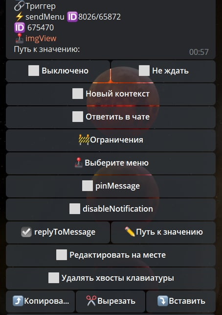

# sendMenu

**sendMenu** - показать пользователю меню (сообщение с инлайн кнопками). Вы можете выбрать какой из подпунктов меню открыть при срабатывании реакции.

| Функция | Описание |
| --- | --- |
| **Ответить в чате** | При включении, направление вывода сообщения может измениться с бота на чат, если реакция будет выполняться в чате. |
| **pinMessage** | Закрепляет отправленное сообщение, аналогична реакции pin. |
| **disableNotification** | Отключит оповещение о новом сообщении. |
| **replyToMessage** | Сообщение отправляется в ответ на сообщение запустившее триггер |
| **Путь к значению** | Позволяет указать переменную с message_id, где будет указано сообщение на которое необходимо ответить. |
| **Редактировать на месте** | Редактирование сообщения и кнопок на месте, не переотправляя меню заново. |
| **Удалять хвосты** | Результаты этих реакций будут удалены при входе в другой раздел клавиатуры.  |

