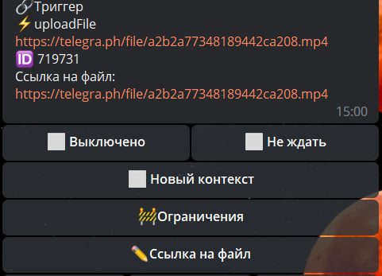

# uploadFile
**uploadFile** - загрузить файлы в Телеграм по ссылке. 

Реакция поддерживает использование как прямых ссылок, так и путь до ссылки: ```${localVar.url}```



После загрузки файла, в логах будет доступен следующий объект: 

```
${uploadedFile}
```

::: details Подробнее

```json
    "uploadedFile": {
      "filename": null,
      "title": null,
      "mimeType": null,
      "thumbId": 0,
      "sourceId": 0,
      "localSave": false,
      "downloaded": false,
      "groupId": 0,
      "id": 332510,
      "fileSize": 421122,
      "extension": ".jpg",
      "url": "https://cs14.pikabu.ru/post_img/big/2023/10/01/11/1696187626117121924.jpg",
      "sourceType": 25,
      "botId": 5622,
      "type": 1,
      "fileId": "AgACAgIAAx0ETyzutgACh_plGcYTzsiRiVMZiI6laRS_RHSsxAACO88xG0su0Eh9lTTvlnWe3wEAAwIAA3cAAzAE",
      "updatedAt": "2023-10-01T19:18:44.201Z",
      "createdAt": "2023-10-01T19:18:44.201Z"
}
```
:::

Отправить полученный файл можно с помощью макроса [!{attachment}](/ext/macros/attachment/#fileid)

::: tip **Особенности**
* В боте должен быть подключен [технический чат](https://qnext.app/docs/admin/setting/#%D0%BE%D0%B1%D1%89%D0%B8%D0%B5-%D0%BD%D0%B0%D1%81%D1%82%D1%80%D0%BE%D0%B8%D0%BA%D0%B8-%D0%B1%D0%BE%D1%82%D0%B0)
* Размер файла: до 10мб
* Длительность загрузки: до 10 секунд.
::: 


