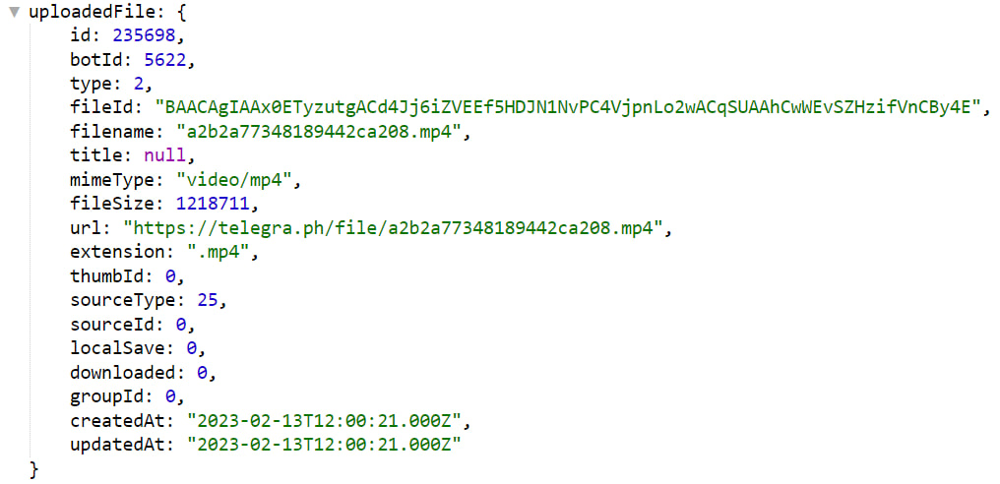

# uploadFile
**uploadFile** - загрузить файлы в Телеграм по ссылке. 

Реакция поддерживает использование как прямых ссылок, так и путь до ссылки: `${localVar.url}`

Отправить полученный файл можно с помощью макроса [attachment](/ext/macros/attachment/#fileid)

**Особенности**
* Размер файла: до 10мб
* Длительность загрузки: до 10 секунд.

