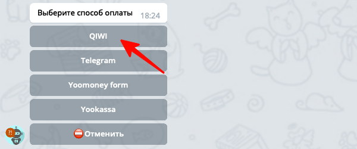
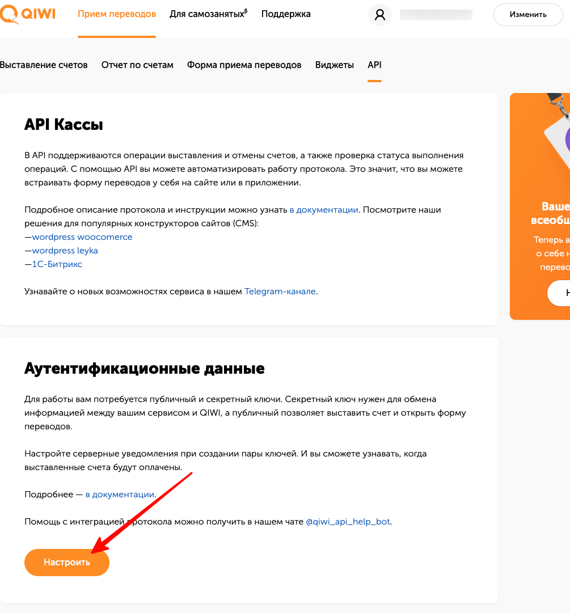
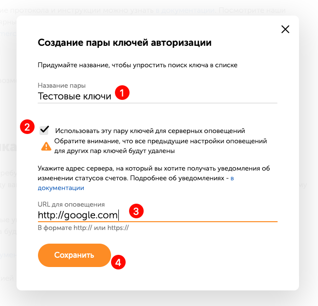
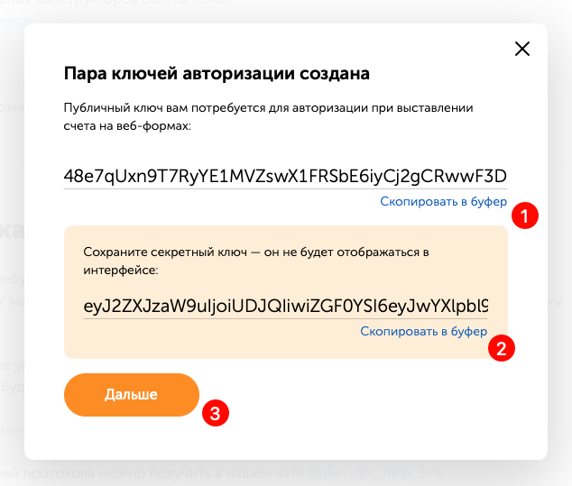
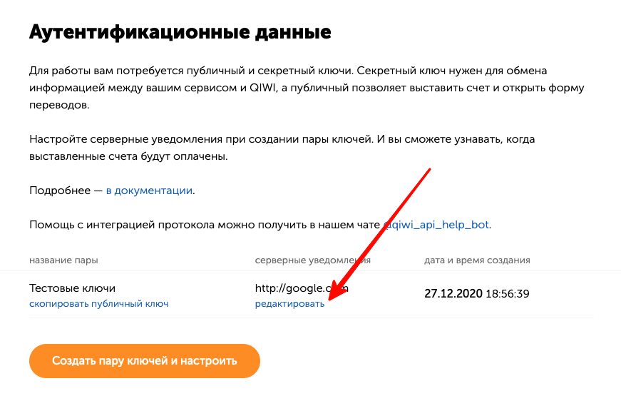
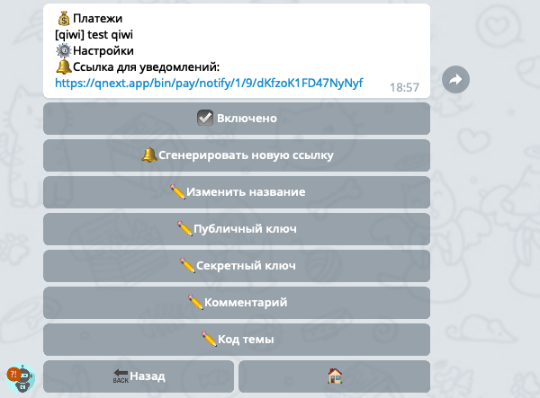
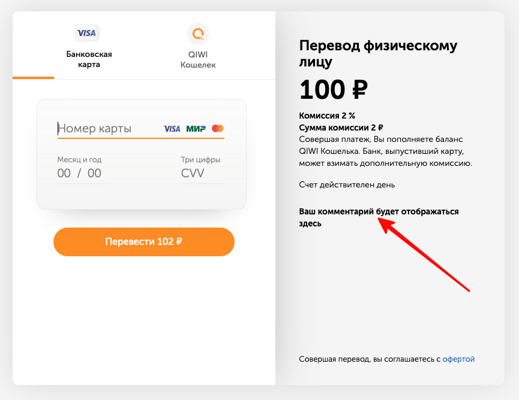
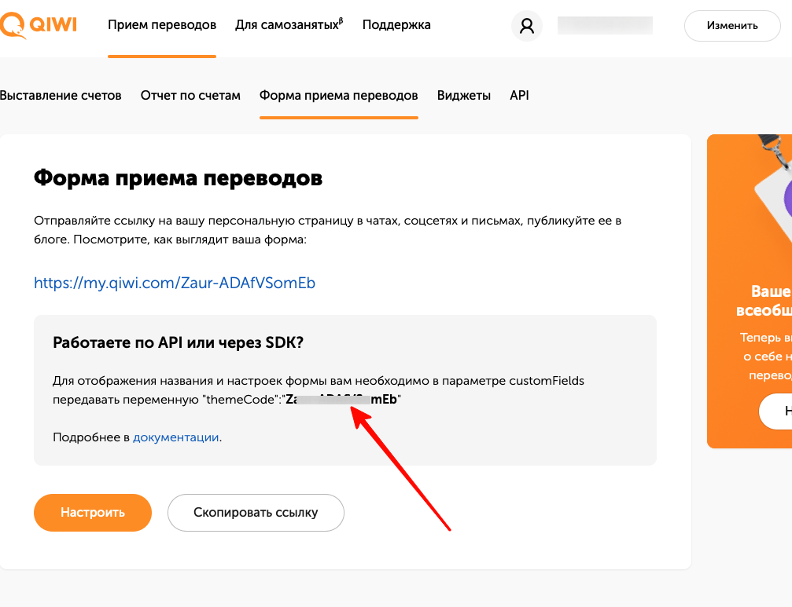

## QNext. Прием платежей с помощью QIWI кошелька
* [Подключение](#подключение)
* [Как получить ключи?](#как-получить-ключи?)
  * -  [Настройка уведомлений](#настроика-уведомлении)
* [Настройки](#настроики)
### Подключение

1) Войдите в раздел `💰Платежи->Способы` оплаты из главного меню вашего бота, нажмите кнопку `➕Добавить`, после чего выберите способ **QIWI**: 



2) Введите название платежа, это название будет видеть пользователь вашего бота при попытке оплатить.

3) В следующие два шага бот попросит прислать Публичный и Секретный ключи. После чего создание способа оплаты будет завершено. 
### Как получить ключи?

Получить Публичный и Секретный ключ можно в личном кабинете QIWI по адресу: [https://qiwi.com/p2p-admin/transfers/api](https://qiwi.com/p2p-admin/transfers/api)

Откройте ссылку, нажмите на кнопку **Настроить**:



Откроется окно создания ключей, в этом окне необходимо:
1 Написать название
2 Включить галочку `☑️Использовать пару ключей для серверных уведомлений`. ⚠️Это надо сделать обязательно, иначе бот не будет получать информацию о том, что кто то завершил платеж.
3 В поле URL надо написать ссылку по которой ваш бот будет получать уведомления от QIWI. Бот выдаст вам такую ссылку после создания метода оплаты, поэтому пока напишите сюда любую ссылку, потом мы эту ссылку поправим.
4 Нажмите кнопку Сохранить:



На следующем шаге QIWI покажет вам ваши ключи, которые необходимо где нибудь сохранить.
```plain
⚠️Не пытайтесь копировать ключи путем выделения строки мышкой, ключи очень длинные, есть риск что вы пропустите какой нибудь символ, и тогда платежи не будут работать. Для копирования ключей используйте кнопку **Скопировать в буфер**
```

Нажмите кнопку **Дальше**, чтобы завершить процесс получения ключей:


### Настройка уведомлений

После того как вы завершили создания способа оплаты в своем боте, откройте настройки только что созданного способа оплаты, и скопируйте `🔔Cсылку для уведомлений`, которую вам показывает ваш бот. Эту ссылку необходимо вставить в созданную пару ключей в [личном кабинете QIWI](https://qiwi.com/p2p-admin/transfers/api):




### Настройки

В разделе ⚙️Настройки можно увидеть следующие опции:


* `🔔Сгенерировать новую ссылку` - вы получите новую ссылку для серверных уведомлений, при этом старая ссылка перестанет работать, а это значит что новую ссылку необходимо будет указать в настройках ключей в личном кабинете QIWI, как это сделать смотрите в разделе [Настройка уведомлений](#настроика-уведомлении).
* `✏️Комментарий` - вы можете указать текст комментария, который будет отображаться у пользователя на странице оплаты:


* `✏️Код темы` - это специальный код, который позволит вам изменить внешний вид страницы оплаты. Вы можете самостоятельно настроить вашу форму оплаты на странице в QIWI по адресу: [https://qiwi.com/p2p-admin/transfers/link](https://qiwi.com/p2p-admin/transfers/link). Пройдите по ссылке, настройте внешний вид вашей формы, и скопируйте полученный код темы:



[⬅️QNext. Платежи](/docs-test/pay)
  
[Original](https://telegra.ph/QNext-Payments-QIWI-12-14)
