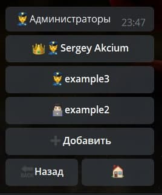
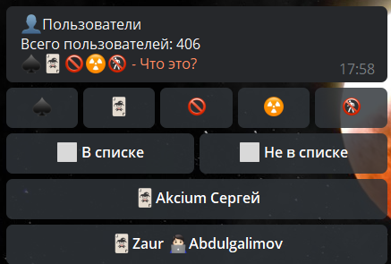
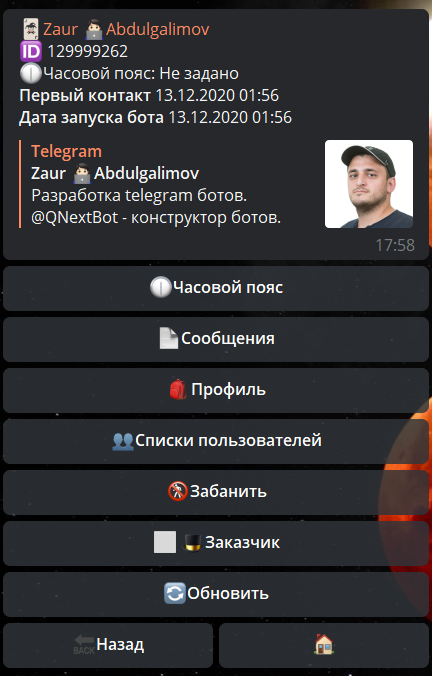
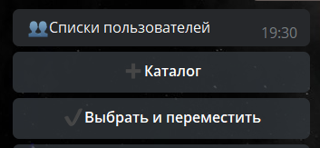
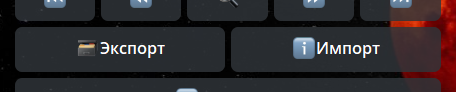
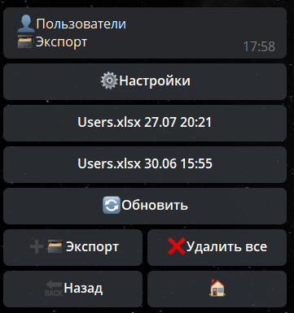
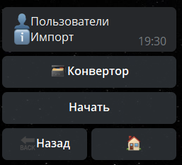

# Люди

**Люди** - раздел отвечающий за работу с пользователями бота. 

| Тип                               | Описание                                                                                  |
|-----------------------------------|-------------------------------------------------------------------------------------------|
| [Администраторы](#администраторы) | Пользователи бота, имеют расширенные полномочия по настройке бота.                        |
| [Пользователи](#пользователи)     | Пользователи бота, имеют доступ только к созданным администраторами функциям внутри бота. |

## Администраторы

Администраторы делятся на 3 категории:

|                Тип                 | Описание                                                                                    |
|:----------------------------------:|---------------------------------------------------------------------------------------------|
|            👑 Создатель            | имеет полные права над ботом. _Может назначать админов, удалять админов, удалить бота._     |
|          👮 Администратор          | имеет полные права внутри бота. _Может назначать админов, но не может их удалять._          |
| 👨🏻‍💻 Ограниченный администратор | имеет доступ только к разделам, в которых ему разрешил доступ Создатель или Администратор.* |

* Для ограниченных администраторов, недоступно стандартное меню администратора (/main). Ограниченным администраторам необходимо создавать свое меню с помощью реакции [adminMenu](/admin/other/reactions/adminmenu/).

::: details Скриншот интерфейса

:::

## Пользователи

|                      Тип                       | Описание                                                   |
|:----------------------------------------------:|------------------------------------------------------------|
|                  [Все](#все)                   | Выводит списком всех людей, которых хотя бы раз видел бот. |
| [Списки пользователей](#списки-пользователей)  | Выводит списки пользователей.                              |

### Все

В разделе пользователи находятся все пользователи бота, а так же те, кого хотя бы раз видел бот.

Все пользователи бота разделены на 5 групп:

| Тип | Описание                                |
|-----|-----------------------------------------|
| ♠   | Пользователь НЕ запускал бота в привате |
| 🃏  | Пользователь запустил бота в привате    |
| 🚫  | Пользователь заблокировал бота          |
| ☢   | Аккаунт пользователя удален             |
| 🚷  | Пользователь забанен в боте             |

::: details Скриншот интерфейса

:::

## Профиль пользователя бота

В этом разделе можно увидеть и использовать следующие функции:

|        Функция         | Описание                                                                                                                                                                                                                                                                                                                   |
|:----------------------:|----------------------------------------------------------------------------------------------------------------------------------------------------------------------------------------------------------------------------------------------------------------------------------------------------------------------------|
|     🕧Часовой пояс     | возможность установить персональный часовой пояс. По умолчанию установлен часовой пояс по [**UTC**](https://ru.wikipedia.org/wiki/%D0%92%D1%81%D0%B5%D0%BC%D0%B8%D1%80%D0%BD%D0%BE%D0%B5_%D0%BA%D0%BE%D0%BE%D1%80%D0%B4%D0%B8%D0%BD%D0%B8%D1%80%D0%BE%D0%B2%D0%B0%D0%BD%D0%BD%D0%BE%D0%B5_%D0%B2%D1%80%D0%B5%D0%BC%D1%8F). |
|       Сообщение        | отправить сообщение пользователю.                                                                                                                                                                                                                                                                                          |
|        Профиль         | показать содержимое профилей пользователя. Подробнее можно [**прочитать здесь**](/docs/admin/profile).                                                                                                                                                                                                                     |
|  Списки пользователей  | покажет в каких списках находится пользователь.                                                                                                                                                                                                                                                                            |
|        Забанить        | полная блокировка пользователя в боте. Бот перестанет реагировать на пользователя. Реакция для бана: [**banBotUser**](/docs/admin/other/reactions/banbotuser)— Забанить/Разбанить юзера в боте.                                                                                                                            |
|        Заказчик        | можно назначить 1 заказчика. Подробнее можно [**прочитать здесь**](/docs/root/price)                                                                                                                                                                                                                                       |

::: details Скриншот интерфейса

:::

### Списки пользователей

Удобный механизм для сортировки пользователей.

::: details Скриншот интерфейса

:::

С этим разделом связаны следующие сущности:

[Списки пользователей - реакции](/docs/admin/userlist)

[Ограничение inUserList](/docs/ext/restrictions)

## Экспорт и Импорт

::: details Скриншот интерфейса

**Экспорт** — выгрузка списков пользователей бота в Excel файл с помощью [Конвертора](/docs/admin/converter)
Файл будет выгружен в формате .xlsx

**Импорт** - загрузка списков пользователей в бота из файла с помощью [Конвертора](/docs/admin/converter)

::: tip ℹ️  Важно!

* При загрузке бот проверяет доступность каждого юзера, и добавляет в базу только тех, у кого был запущен диалог с ботом в момент проверки ‼️
* Колонка А должна содержать ID пользователей

:::