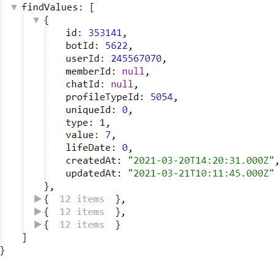

# findProfileValue

**findProfileValue** - найдет все значения профиля, которые удовлетворяют заданным условиям поиска.

Реакция может работать в следующих режимах:

| Режим | Описание                                            |
|:-----:|-----------------------------------------------------|
|   =   | Параметр профиля равен заданному условию            |
|   ≠   | Параметр профиля не равен заданному условию         |
|  <=   | Параметр профиля меньше или равен заданному условию |
|   <   | Параметр профиля меньше заданного условия           |
|  >=   | Параметр профиля больше или равен заданному условию |
|   >   | Параметр профиля больше заданного условия           |

В настройках реакции можно указать сколько значений необходимо загрузить, и каким способом их отсортировать. Доступные следующие типы сортировок:

* По значению
* По времени создания
* По времени жизни (если включено время жизни)

После использования реакции, вся информация будет доступна в переменной:

```plain
${findValues...}`
```
::: details Подробнее



:::

::: tip  Особенности

Загружает первых 200 человек, чей параметр соответствует заданному условию.

:::


