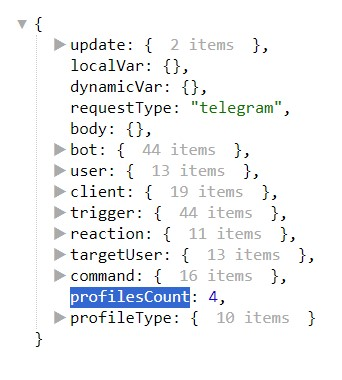

# profilesCount

**profilesCount** - проверяет у скольких людей параметр профиля соответствует указанному условию.

Реакция может работать в следующих режимах:

| Режим | Описание                                            |
|:-----:|-----------------------------------------------------|
|   =   | Параметр профиля равен заданному условию            |
|   ≠   | Параметр профиля не равен заданному условию         |
|  <=   | Параметр профиля меньше или равен заданному условию |
|   <   | Параметр профиля меньше заданного условия           |
|  >=   | Параметр профиля больше или равен заданному условию |
|   >   | Параметр профиля больше заданного условия           |

После использования реакции, вся информация будет доступна в переменной:

```plain
${profilesCount}
```
::: details Подробнее



:::

---

::: tip  Особенности

Не ограничен первыми 200 пользователями, может обработать и проверить хоть миллион пользователей

:::


