# Регулярные выражения

Проверить свои регулярные выражения: [regex101](https://regex101.com/)

Учебник: [Регулярные выражения](https://learn.javascript.ru/regexp-introduction)

**Оглавление**

[[toc]]

### Разбор цифр на составные
```plain
/cmd (\d)(\d)(\d)/
```

**Пример:**

* 123

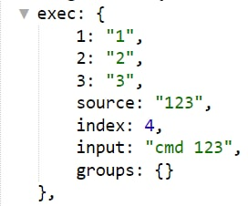

---

### Проверка номера телефона +7 или 8
```plain
/((\+7|8)(\d{10}))/
```
_Ищет номера внутри текста_

**Строгая проверка номера телефона +7 или 8**
```plain
/^(?:\+7|8)\d{10}$/
```

_Ищет полное совпадение сообщения с указанной регуляркой_

**Пример:**

* +71234567890 

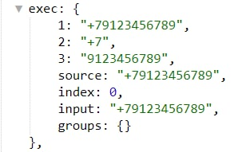

* 81234567890

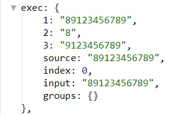

---

### Полная дата

```plain
/((?<day>\d{1,2}).(?<month>\d{1,2}).(?<year>\d{4}))/
```

**Пример:**

* 01.01.2022

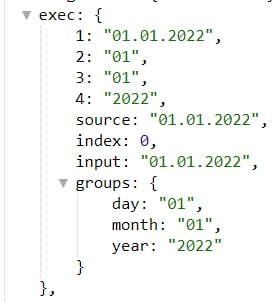

```${exec.1}``` = 01.01.2022

---

### Необязательное дополнение к команде
```plain
/!cmd(\s+((\n|.)+))?/i
```

**Пример:**

!cmd

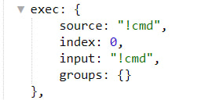

!cmd custom text

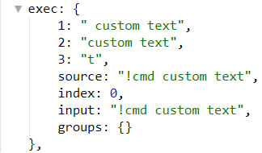

*все что будет идти после слова !cmd можно найти в ```${exec.2}```

---

### Обработка новой строки
```plain
/cmd(\s|\|n.)+/i
```

**Пример:**

* !cmd text0

text1

text2

text3

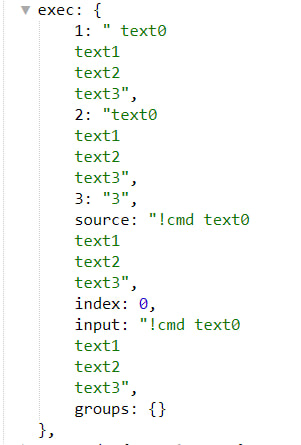

*все что будет идти после слова !cmd можно найти в ```${exec.2}```

---

### Поиск любых хештегов в текст
```plain
/#\w+/
```

**Пример:**

* text #hashtag text

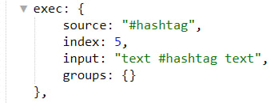

---

### Проверка диапазона чисел от 10 до 99
```plain
/^([1-9][0-9])$/
```

Примет числа:

10, 15, 25, 76, 88, 99.

Не примет числа: 

1, 5, 101, 200.

---

### Разделение введенного текста с помощью запятой

```plain
/cmd ([^,]+), ([^,]+), ([^,]+)$/
```

**Пример:**

* /cmd text1, text2, text3


```${exec.1}``` = text1

```${exec.2}``` = text2

```${exec.3}``` = text3

---

### Разбор ссылки типа t.me/ для получения username

```plain
/t\.me\/(.+)/ 
```

**Пример:**

* Https://t.me/qnext


```${exec.1}``` = qnext

**Пример:** 

* t.me/qnext

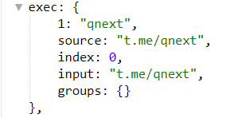

```${exec.1}``` = qnext

---

### Вывод текста введенного вокруг команды
```plain
/(.+)?(!|\/)cmd(.+)?/
```

**Пример:**

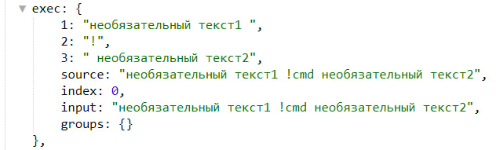

```${exec.1}``` = необязательный текст1

```${exec.3}``` = необязательный текст2

---

### Универсальная административная регулярка
```plain
/^(?<cmd>(!|\/)[^\s]+)\s+(?<user>[^\/\s]+)(\s+((?<durationValue>\d+)(?<durationType>d|h)))?(\s+(?<reason>[^\/]+))?$/i
```

_Подходит для задач когда не требуется отвечать на сообщение юзера._

Пример:

* !cmd 123456789 1d reason

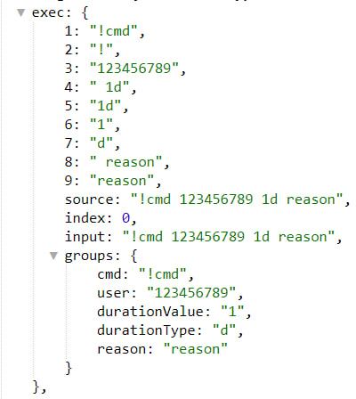

```${exec.group.cmd}``` = !cmd

```${exec.group.user}``` = 123456789

```${exec.group.durationValue}``` = 1

```${exec.group.durationType}``` = d

```${exec.group.reason}``` = reason

---

### Универсальная административная регулярка
```plain
/^(?<cmd>(!|\/)[^\s]+)(\s+((?<durationValue>\d+)(?<durationType>d|h)))?(\s+(?<reason>[^\/]+))?$/i
```

_Подходит для задач когда требуется отвечать на сообщение юзера._

* !cmd 1d reason

```${exec.group.cmd}``` = !cmd

```${exec.group.durationValue}``` = 1

```${exec.group.durationType``` = d

```${exec.group.reason}``` = reason