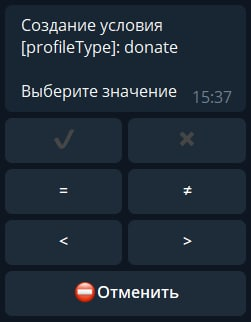

profleValue - условие проверяет параметр профиля. Этим можно ограничить возможность пользоваться функциями.

✔️ — в профиле есть данные (любые)

✖️ — в профиле нет данных (пустой/отсутствует)

= — профиль равен значению

≠ — профиль не равен значению

< — профиль меньше заданного значения

> — профиль больше заданного значения

