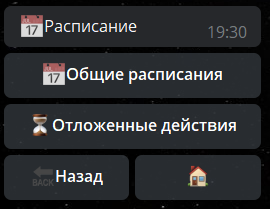

# Расписание

**Расписание** - раздел, основная задача которого, выполнение действий в определенный временной промежуток.

В разделе доступно 2 подраздела:

**[Общие расписания](/admin/schedule/general/)** - позволяют выполнять заранее настроенные реакции в определенном временном цикле. Будь то единоразовое срабатывание, или цикличное повторение

**[Отложенное действие](/admin/schedule/pendaction/)** - однократное выполнения заранее настроенных реакций по отношению к определенному пользователю или чату/каналу.

