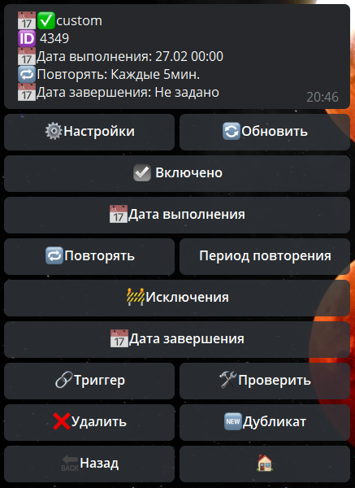

# Расписание

**Расписание** - выполнение заранее настроенных действий в указанное время.

### Создание 

Создание расписания довольное простое, и проблем не вызывает. 

Если у вас все же возникли трудности, ниже по ссылке есть инструкция:

[**Видео-курс по созданию расписания**](https://t.me/QNextCases/122)

### Настройки расписания

— **⚙️Настройки:**

| Функция | Описание |
| --- | --- |
| Тех название | изменить техническое название расписания |
| Удалить расписание  после выполнения | расписание удаляется полностью, дабы не засорять список расписаний |

| Функция | Описание |
| --- | --- |
| **☑️Включено** | включение или отключение расписания |
| **Исключения** | настройка дней и времени, когда расписание не будет срабатывать. |
| **Дата выполнения** | Дата первого выполнения расписания |
| **Повторять** | выбрать тип срабатывания: минута, час, день, неделя. |
| **Период повторения** | указать частоту срабатывания, мин 1, макс 200 |
| **Исключить время** | можно настроить что расписание будет только с утра до вечера, или наоборот только ночью. |
| **Исключить день** | можно настроить что расписание будет работать только в будни, или наоборот, только в выходные. |
| **Дата завершения** | дата когда расписание будет завершено. |
| **Триггер** | главный раздел, здесь необходимо указывать все реакции, которые должно выполнить расписание. Подробнее о реакциях [**можно узнать здесь**](/docs/admin/other/reactions). |
| **Проверить** | запускает расписание.  |
| **Дубликат** | создание точной копии расписания |

* **Дата выполнения, Повторять, Период повторения** - соответствуют настройкам при создании расписания.

**Расписание можно отключить реакцией:**

[**scheduleSwitch**](/docs/admin/switch/scheduleswitch) - Изменить состояние расписания

::: tip ℹ️
!! Важно, у расписания нет инициатора. Все реакции типа loadProfile или sendMessage без реакций типа: takeUsers, takeChat корректно работать не будут!!
:::
