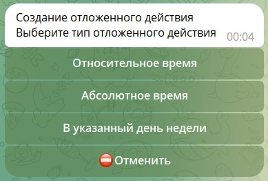
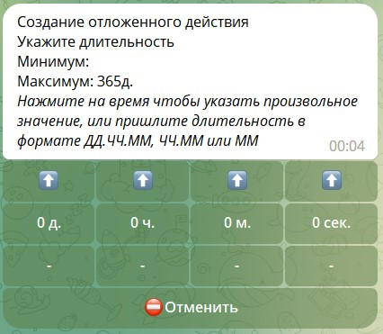
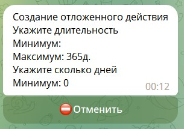
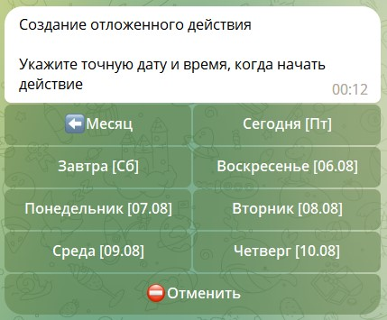
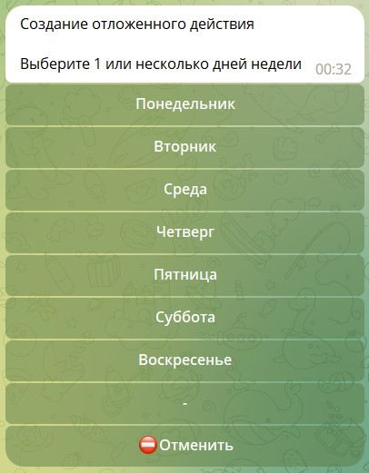
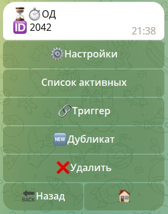
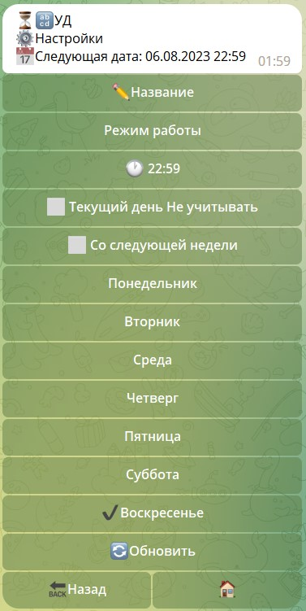
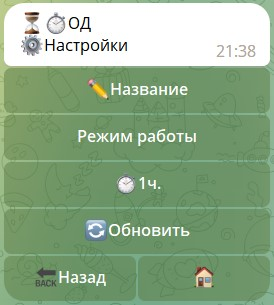

# ОД (отложенные действия)

**ОД** - Отложенное действие, которое можно запустить после выполнения пользователем любого действия, связанного с ботом.

Отложенные действия могут быть нескольких типов:

## Типы отложенных действий

| Название                                                                        | Описание                                               |
|---------------------------------------------------------------------------------|--------------------------------------------------------|
| [**Относительное время**](/admin/schedule/pendaction/#относительное-время)      | ОД будет выполнено через N времени после запуска       |
| [**Абсолютное время**](/admin/schedule/pendaction/#абсолютное-время)            | ОД будет выполнено в определенный (фиксированный день) |
| [**В указанный день недели**](/admin/schedule/pendaction/#указанные-дни-недели) | ОД будет выполнено в указанные дни недели              |

::: details Подробнее



:::


### Относительное время

Относительное время — отложенное действие будет выполнено через указанное в настройках время. 

::: tip

Время можно задавать 2 способами:

1. Нажимая стрелочки вверх или вниз

   ::: details Подробнее
   
   :::

2. Нажать на цифру 0 и в открывшемся окне ввести цифру руками

   ::: details Подробнее
   
   :::

:::

### Абсолютное время

Абсолютное время — отложенное действие выполнено в определенный (фиксированный день).

::: details Подробнее



:::


### Указанные дни недели

В указанный день недели — отложенное действие будет выполнено в указанные дни недели.

::: details Подробнее



:::

::: tip Полезно

Можно выбирать несколько дней

:::

## Настройки

| Функция                                                      | Описание                                                  |
|--------------------------------------------------------------|-----------------------------------------------------------|
| **Название**                                                 | Техническое название, которое видят только администраторы |
| [**Режим работы**](/admin/schedule/pendaction/#режим-работы) | Отложенные действия могут работать в нескольких режимах   |

::: details Подробнее



:::

Настройка времени будет отличаться в зависимости от выбранного типа ОД.

* В случаях с ОД типа "относительное время" и "абсолютное время" - интерфейс будет полностью соответствовать тому, 
что был при создании ОД.

* В случае с ОД типа "В указанный день недели" - интерфейс будет иметь дополнительные настройки времени, а именно:

| Функция             | Описание                                                                                                        |
|---------------------|-----------------------------------------------------------------------------------------------------------------|
| Не учитывать        | в случае, если дата выполнения соответствует дате создания, эта функция позволит не срабатывать в день создания |
| Со следующей недели | позволяет запустить ОД со следующей недели.                                                                     |


::: details Подробнее



:::

## Режим работы

| Режим                  | Описание                                                                             |
|------------------------|--------------------------------------------------------------------------------------|
| **Режим по умолчанию** | запускает ОД, при попытке повторного запуска ОД ничего не произойдет                 | 
| **Режим замены**       | запускает ОД, при повторном запуске перезапускает работающее ОД                      |
| **Режим добавления**   | запускает ОД, при повторном запуске создает еще одно ОД, не отменяя ранее запущенные |

::: warning ВАЖНО
Все режимы работают в рамках конкретного ОД. Одним ОД нельзя заменить другое ОД.
:::

#### Триггер

Главный раздел, здесь необходимо указывать все реакции, которые должно выполнить ОД. Подробнее о реакциях [**можно узнать здесь**](/docs/admin/other/reactions).

#### Дубликат 
Создание точной копии ОД.

::: details Подробнее



:::


::: tip Полезно️
* ОД сохраняет весь объект ```${update}``` при запуске. в триггере ОД полноценно работают все переменные, такие как: ```${chat.id}```, ```${user.id}```, ```${update.message.message_id}```.
* Если ОД запускается внутри реакции takeChat, то в реакции sendMessage будет работать функция "Ответить в чате"
:::
