## QNext. Настройки бота

Настройки бота - раздел в процессе написания


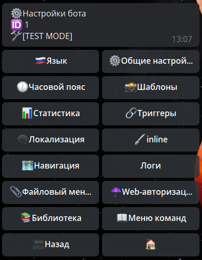
### Оглавление
* [**Язык**](#язык)
* [**Общие настройки**](#общие-настроики)
* [**Часовой пояс**](#часовои-пояс)
* [**Шаблоны**](#шаблоны)
* [**Статистика**](#статистика)
* [**Триггеры** ](#триггеры)
* [**Локализация**](#локализация)
* [**inine**](#inline)
* [**Навигация**](#навигация)
* [**Логи**  ](#логи)
* [**Файловый менеджер**](#фаиловыи-менеджер)
* [**Web-авторизация**](#web-авторизация)
* [**Библиотека**](#библиотека)
* [**Меню команд**  ](#меню-команд)


### Язык


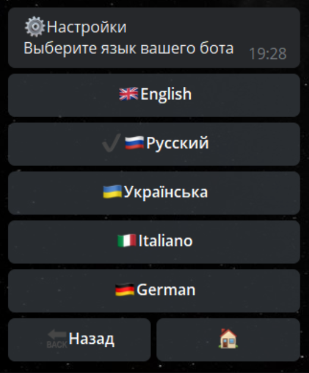

Доступны следующие локализации административного меню:
* Английский
* Русский
* Украинский
* Итальянский 
* Германский
```plain
[Вернуться к Оглавлению](#оглавление)```
### Общие настройки


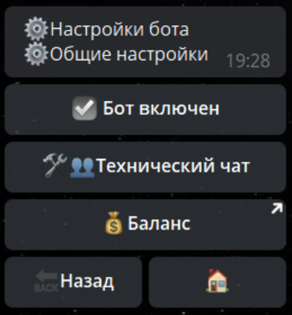

**Бот включен**, имеет 2 режима:
* ☑️Бот включен  — реагирует на все команды и действия
* ◻️Бот выключен — не реагирует на команды, реагирует только на админ команду /main

**Технический чат** - позволяет указать технический чат, куда будут приходить все ошибки бота, а так же, куда будет удобно отправлять логи бота. Для работы с техническим чатом используется реакция:
* [**takeTechChat**  ](/docs-test/reactions/taketechchat)- Загрузить технический чат

**Баланс** - открытие баланса бота в главном боте [@Qnextbot](http://t.me/QNextBot) 
```plain
[Вернуться к Оглавлению](#оглавление)```
### Шаблоны

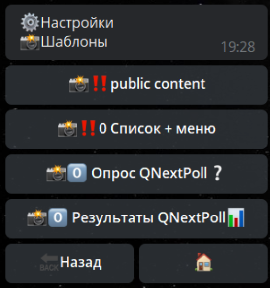

Раздел для работы с шаблонами контентов ранее созданных в разделе Контенты.

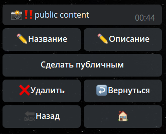

**Название** (макс 32 симв) - редактирование название шаблона 

**Описание** (макс 200 симв) - редактирование описания шаблона

**Сделать публичным** - возможность копировать шаблон в другие боты
```plain
[Вернуться к Оглавлению](#оглавление)```
### Статистика


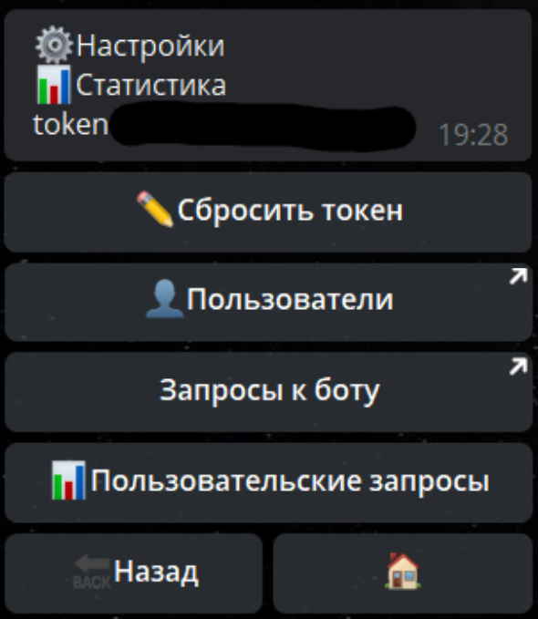

**Токен** - конфиденциальная информация, с помощью которой генерируются все показатели (данные, цифры) бота по запросам.

**Пользователи** - статистика по новым запускам бота, а так же по количеству пользователей которые пользуются ботом.

**Запросы к боту** - статистика скорости и отклика бота на запросы.
### Триггеры

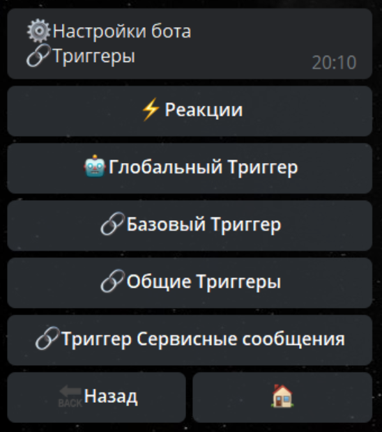

[**Документация по триггерам**](/docs-test/triggers)


```plain
[Вернуться к Оглавлению](#оглавление)```
### Локализация 


**Локализация** - возможность изменить любой системный текст в боте для пользователя.

Для изменения необходимо выбрать: Кастомная — Найти фразу — ввести текст кнопки - заменить на свой. Готово.
```plain
[Вернуться к Оглавлению](#оглавление)```
### inline


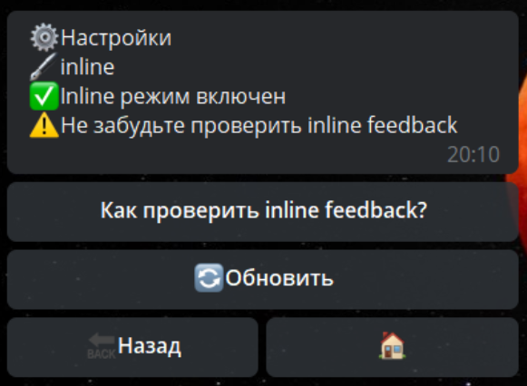

**Инлайн режим** - режим позволяющий использовать бота из любого места вызывая бота с помощью юзернейма.

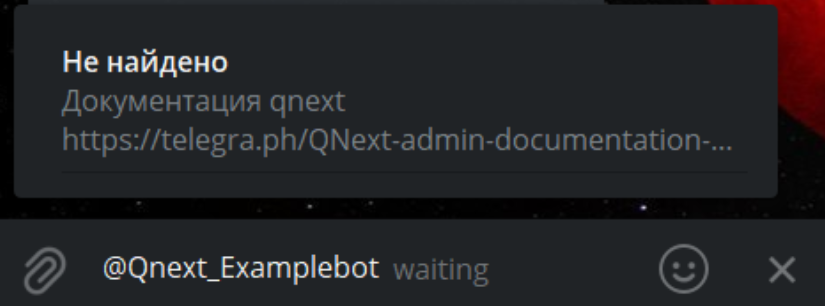
```plain
[Вернуться к Оглавлению](#оглавление)```
### Навигация


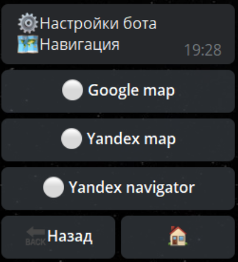

Определяет, с помощью каких карт будут приоритетно открываться отправленная геолокация.
```plain
[Вернуться к Оглавлению](#оглавление)```
### Логи


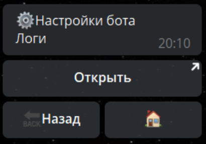

[**Документация по логам**](/docs-test/reactions/log)
```plain
[Вернуться к Оглавлению](#оглавление)```
### Файловый менеджер


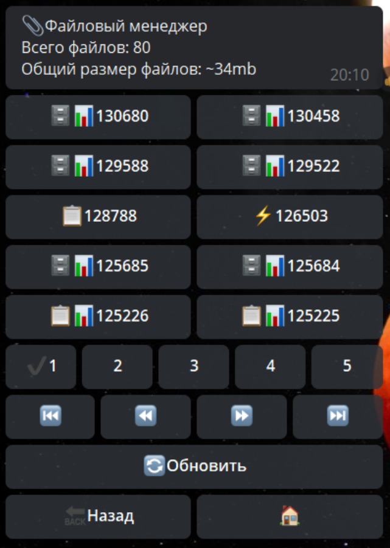

Показывает все загруженные в бота файлы, а так же результаты всех форм и других сущностей в боте, а так же общий вес сущностей бота
```plain
[Вернуться к Оглавлению](#оглавление)```
### Web-авторизация


**Web-авторизация -** необходима для авторизации на сервере платформы, и в дальнейшем открывать логи в любой момент по короткому адресу qnext.app/logs/@username_bot

**Активные сессии** - отображает активные сессии и позволяет их удалять.

**Триггеры** - 
```plain
[Вернуться к Оглавлению](#оглавление)```
### Библиотека


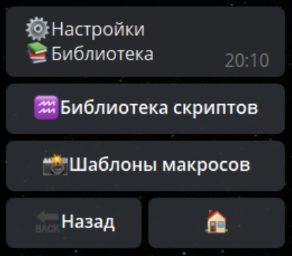

[**Документация по библиотекам**](/docs-test/script/library)
```plain
[Вернуться к Оглавлению](#оглавление)```
### Меню команд


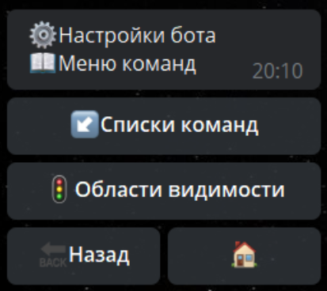

[**Документация по командам**](/docs-test/admin/command-about)
```plain
[Вернуться к Оглавлению](#оглавление)```

[QNext. Документация](/docs-test/)
  
[Original](https://telegra.ph/QNext-admin-setting-about-02-08)