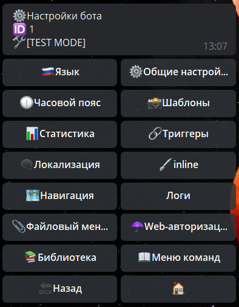
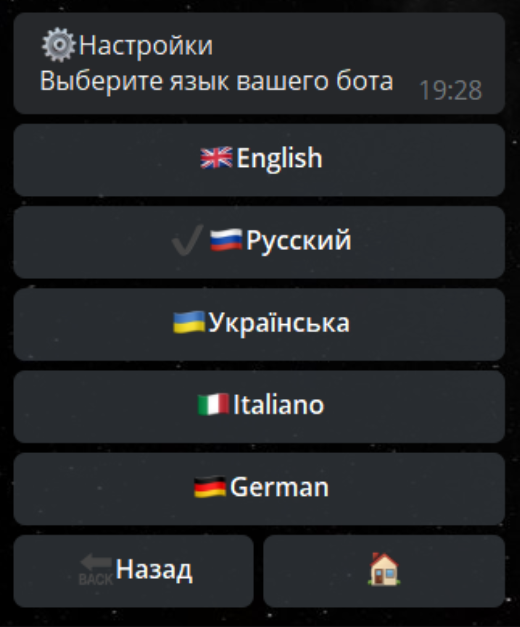
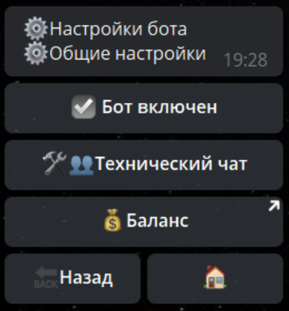
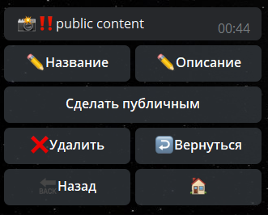
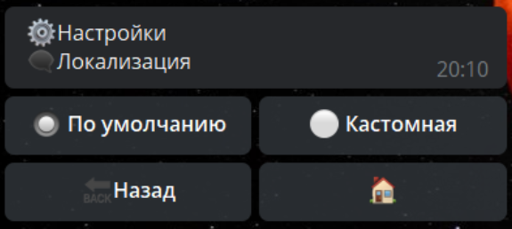
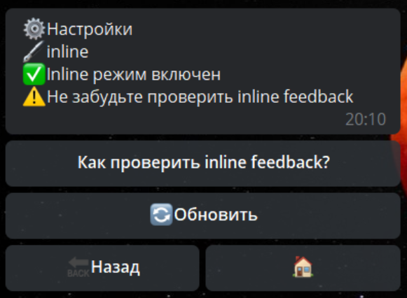
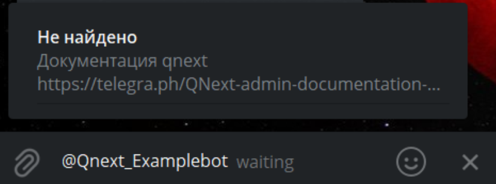
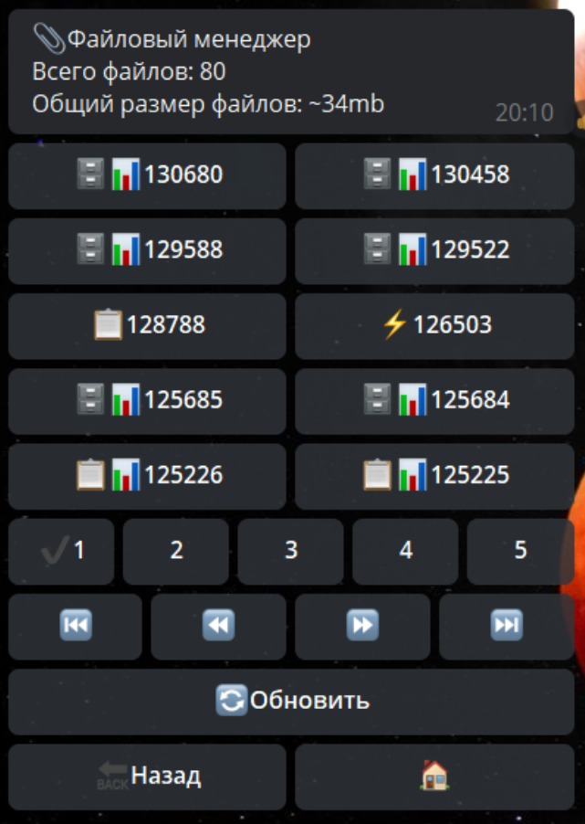
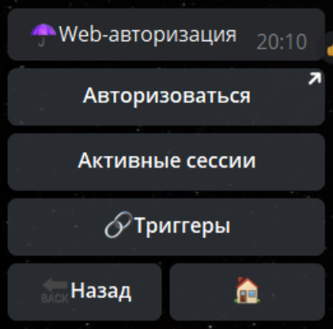
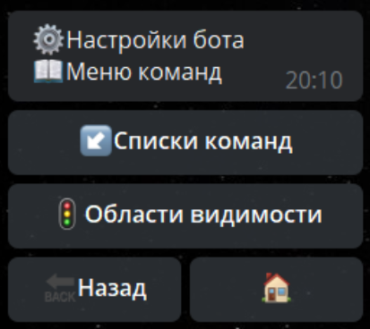

**Настройки бота** - раздел отвечающиий за глобальные настройки бота.

## Языки

Доступны следующие локализации административного меню:
* Английский
* Русский
* Украинский
* Итальянский 
* Германский

## Общие настройки бота

**Бот включен**, имеет 2 режима:
* ☑️Бот включен  — реагирует на все команды и действия
* ◻️Бот выключен — не реагирует на команды, реагирует только на админ команду /main

**Технический чат** - позволяет указать технический чат, куда будут приходить все ошибки бота, а так же, куда будет удобно отправлять логи бота. Для работы с техническим чатом используется реакция:
* [**takeTechChat**  ](/docs-test/reactions/taketechchat)- Загрузить технический чат

**Баланс** - открытие баланса бота в главном боте [@Qnextbot](http://t.me/QNextBot) 
## Шаблоны контентов

Раздел для работы с шаблонами контентов ранее созданных в разделе Контенты.

**Название** (макс 32 симв) - редактирование название шаблона 

**Описание** (макс 200 симв) - редактирование описания шаблона

**Сделать публичным** - возможность копировать шаблон в другие боты

**Токен** - конфиденциальная информация, с помощью которой генерируются все показатели (данные, цифры) бота по запросам.

**Пользователи** - статистика по новым запускам бота, а так же по количеству пользователей которые пользуются ботом.

**Запросы к боту** - статистика скорости и отклика бота на запросы.
## Триггеры

[**Документация по триггерам**](/docs-test/triggers)

## Локализация

**Локализация** - возможность изменить любой системный текст в боте для пользователя.

Для изменения необходимо выбрать: Кастомная — Найти фразу — ввести текст кнопки - заменить на свой. Готово.
## Инлайн

**Инлайн режим** - режим позволяющий использовать бота из любого места вызывая бота с помощью юзернейма.

## Навигация

Определяет, с помощью каких карт будут приоритетно открываться отправленная геолокация.

## Логи

[**Документация по логам**](/docs-test/reactions/log)

## Файловый менеджер

Показывает все загруженные в бота файлы, а так же результаты всех форм и других сущностей в боте, а так же общий вес сущностей бота

## Web-авторизация

**Web-авторизация -** необходима для авторизации на сервере платформы, и в дальнейшем открывать логи в любой момент по короткому адресу qnext.app/logs/@username_bot

**Активные сессии** - отображает активные сессии и позволяет их удалять.

**Триггеры** - в процессе написания

## Библиотека

[**Документация по библиотекам**](/docs-test/script/library)

## Меню команд

[**Документация по командам**](/docs-test/admin/command-about)
