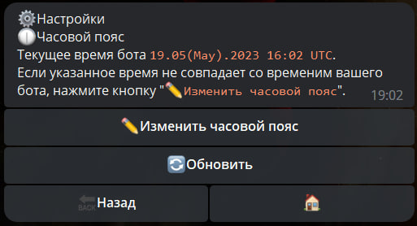
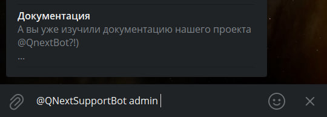

# Настройки бота

**Настройки бота** - раздел отвечающиий за глобальные настройки бота.

|             Настройки бота              |                                          |
|:---------------------------------------:|:----------------------------------------:|
|              [Язык](#язык)              | [Общие настройки](#общие-настройки-бота) |
|      [Часовой пояс](#часовой-пояс)      |           [Шаблоны](#шаблоны)            |
|        [Статистика](#статистика)        |          [Триггеры](#триггеры)           |
|       [Локализация](#локализация)       |            [inline](#inline)             |
|         [Навигация](#навигация)         |              [Логи](#логи)               |
| [Файловый менеджер](#фаиловыи-менеджер) |   [web-авторизация](#web-авторизация)    |
|        [Библиотека](#библиотека)        |       [Меню команд](#меню-команд)        |


## Язык

Раздел отвечающий за локализацию бота. Доступны следующие локализации административного меню:
* **Английский**
* **Русский**
* **Украинский**
* **Итальянский**
* **Немецкий**
* **Китайский**
* 
Локализация бота работает следующим образом:

1. По умолчанию используется русский язык.
2. Наивысший приоритет выбора языка имеет реакция [setUserLanguage](/admin/other/reactions/setuserlanguage/)
3. Если язык не установлен в боте [@qnextbot](https://t.me/qnextbot), то язык определяется настройками вашего бота.

## Общие настройки бота

| Общие настройки    |                                                                                                                                                                                                                                                                                                                                        |
|:-------------------|:---------------------------------------------------------------------------------------------------------------------------------------------------------------------------------------------------------------------------------------------------------------------------------------------------------------------------------------|
| **Бот включен**    | используется для остановки/перезапуска работы бота. • ☑️ — бот работает в обычном режиме, функционал бота доступен всем пользователям. • ⬜️ — бот остановлен, функционал бота не доступен. Администраторам бота доступна команда /main для работы с админменю.                                                                         |
| **Техничекий чат** | предназначен для выбора чата, в который будет направлен вывод ошибок бота, при их появлении. Технический чат удобно использовать для вывода логов бота и записи прочей технической информации. Для направления вывода в технический чат применяется реакция: [takeTechChat](/docs/admin/chat/taketechchat) - Загрузить технический чат |
| **баланс**         | открытие Баланса бота в главном боте [@Qnextbot](http://t.me/QNextBot)                                                                                                                                                                                                                                                                 |

## Часовой пояс

**Часовые пояса** - раздел определяющий время, на которое будет опираться бот, при создании расписания. Время определяется по международному формату в [UTC](https://ru.wikipedia.org/wiki/%D0%92%D1%81%D0%B5%D0%BC%D0%B8%D1%80%D0%BD%D0%BE%D0%B5_%D0%BA%D0%BE%D0%BE%D1%80%D0%B4%D0%B8%D0%BD%D0%B8%D1%80%D0%BE%D0%B2%D0%B0%D0%BD%D0%BD%D0%BE%D0%B5_%D0%B2%D1%80%D0%B5%D0%BC%D1%8F).



## Шаблоны контентов


После выбора определенного шаблона, откроется интерфейс для настройки шаблона.

| Функция                      | Описание                                                              |
|------------------------------|-----------------------------------------------------------------------|
| **Название** (макс 32 симв)  | редактирование название шаблона                                       |
| **Описание** (макс 200 симв) | редактирование описания шаблона                                       |
| **Сделать публичным**        | возможность копировать шаблон в другие боты                           |
| **Удалить**                  | удаление шаблона                                                      |
| **Вернуться**                | если шаблон открыт из раздела контент - возвращает обратно в контент. |


## Статистика

| Функция            | Описание                                                                                                     |
|--------------------|--------------------------------------------------------------------------------------------------------------|
| **Токен**          | конфиденциальная информация, с помощью которой генерируются все показатели (данные, цифры) бота по запросам. |
| **Пользователи**   | статистика по новым запускам бота, а так же по количеству пользователей которые пользуются ботом.            |
| **Запросы к боту** | статистика скорости и отклика бота на запросы.                                                               |

## Триггеры

**[Документация по триггерам](/docs/article/triggers)**

| Триггер                     | Описание                                                                                                                                                              |
|-----------------------------|-----------------------------------------------------------------------------------------------------------------------------------------------------------------------|
| Глобальный триггер          | выполняется всегда, при любом активации любого действия не зависимо от наличия или отсутствия каких любо других триггеров.                                            |
| Базовый триггер             | выполняется всегда перед выполнением любого другого триггера                                                                                                          |
| Общие триггеры              | выполняется при использовании реакции [runTrigger](/admin/other/reactions/runtrigger/). Необходим, когда собираетесь использовать одинаковые реакции в разных местах. |
| Триггер Сервисные сообщения | выполняется при публикации в чате или канале сервисных сообщений.                                                                                                     |

## Локализация

**Локализация** - возможность изменить любой системный текст в боте для пользователя.

Для изменения необходимо выбрать: ```Кастомная —> Найти фразу —> ввести текст кнопки -> заменить на свой.``` Готово.


## Inline

**Инлайн режим** - режим позволяющий использовать бота из любого места вызывая бота с помощью юзернейма. 



## Навигация

Определяет, с помощью каких карт будут приоритетно открываться отправленная геолокация.

На выбор предлагаются 3 варианта:

* Google map
* Yandex map
* Yandex navigator

## Логи

[Документация по логам](/docs/ext/log/)

## Файловый менеджер

Отображает все файлы, которые видел бот и с которыми он может работать, а так же результаты всех форм и других сущностей в боте, а так же общий вес сущностей бота

## Web-авторизация

| Функция             | Описание                                                                                                                                       |
|---------------------|------------------------------------------------------------------------------------------------------------------------------------------------|
| **Авторизоваться**  | необходима для авторизации на сервере платформы, и в дальнейшем открывать логи в любой момент по короткому адресу qnext.app/logs/@username_bot |
| **Активные сессии** | отображает активные сессии и позволяет их удалять.                                                                                             |
| **Триггеры**        | в процессе написания                                                                                                                           |

## Библиотека

Используется для создания собственной библиотеки скриптов и макросов, которые будут доступны в любом разделе вашего бота.

[Документация по библиотекам](/docs/ext/script/library)

[Документация по Шаблонам макросов](/docs/ext/macros/template/)

## Меню команд

Создание и редактирование меню команд в боте.

[Документация по меню команд](/docs/admin/command)


