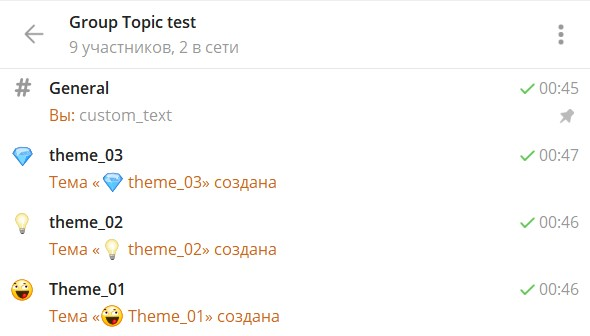

# Темы

Телеграм ввел в чаты новую сущность "Темы". Это мини-чаты внутри одного чата.

Для открытия доступа к темам в чате должно быть не менее 200 человек.

Для работы с темами Телеграмом предусмотрены следующие реакции:

### Реакции

| Реакция | Описание |
| --- | --- | 
| [createForumTopic](/admin/topic/createForumTopic/) | Создать тему |
| [closeForumTopic](/admin/topic/closeForumTopic/) | Закрыть тему |
| [deleteForumTopic](/admin/topic/deleteForumTopic/) | Удалить тему |
| [editForumTopic](/admin/topic/editForumTopic/) | Редактировать тему в чате |
| [getForumTopicIconStickers](/admin/topic/getForumTopicIconStickers/) | Получить список стикеров для темы |
| [reopenForumTopic](/admin/topic/reopenForumTopic/) | Переоткрыть тему в чате |
| [unpinAllForumTopicMessages](/admin/topic/unpinAllForumTopicMessages/) | Очистить список закрепленных сообщений в теме форума |
