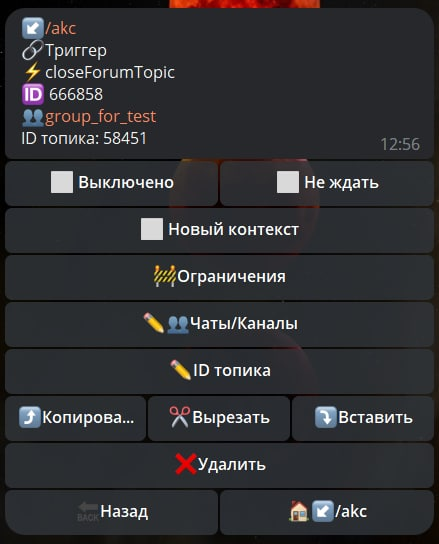

# closeforumtopic

**closeforumtopic** - в процессе написания

| Функция | Описание |
| --- | --- | 
| Чаты/Каналы | Необходимо указать ID чата или ссылку на чат типа @username |
| ID топика | Название для закрытия топика |

Method bot.api [closeForumTopic](https://core.telegram.org/bots/api#closeforumtopic)