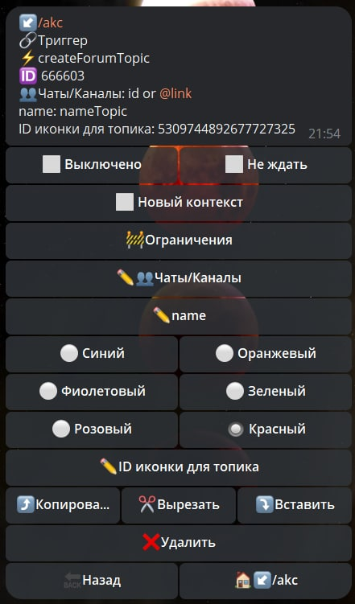

# createForunTopic

**createForunTopic** - реакция для создания нового топика в чате.

| Функция | Описание |
| --- | --- | 
| Чаты/Каналы | Необходимо указать ID чата или ссылку на чат типа @username |
| name | Название для создания топика |
| Цвета | Предусматривает создание иконки-эмодзи из базового набора |
| ID иконки для топика | список доступных ID эмодзи можно запросить с помощью реакции [getForumTopicIconStickers](/admin/topic/getForumTopicIconStickers/) |

**Method bot.api [createForumTopic](https://core.telegram.org/bots/api#createforumtopic)**