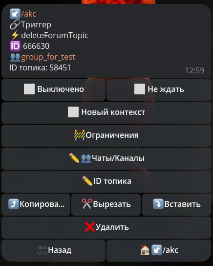

# deleteForumTopic

**deleteForumTopic** - Реакция для удаления топика

| Функция | Описание |
| --- | --- | 
| Чаты/Каналы | Необходимо указать ID чата или ссылку на чат типа @username |
| ID топика | Название для удаления топика |

**Method bot.api [deleteForumTopic](https://core.telegram.org/bots/api#deleteforumtopic)**