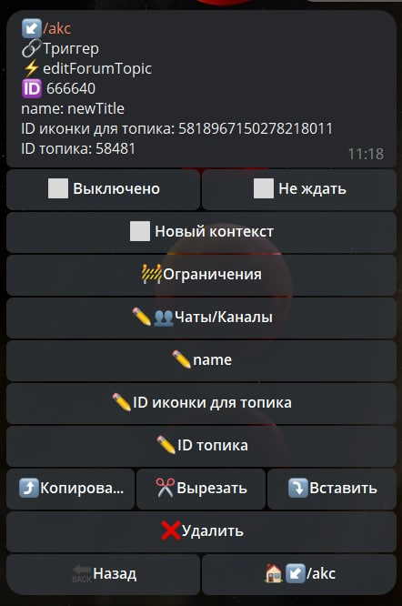

# editForumTopic 

**editForumTopic** - реакция редактирует параметры топика, такие как: название, эмодзи - иконку.

| Функция | Описание | Необходимость |
| --- | --- | --- |
| Чаты/Каналы |  Необходимо указать ID чата или ссылку на чат типа @username | Обязательно |
| name | Название для создания топика | Опционально |
| ID иконки для топика | Иконка топика | Опционально |
| ID топика | ID топика который необходимо изменить | Обязательно |

**Method bot.api [editForumTopic](https://core.telegram.org/bots/api#editForumTopic)**