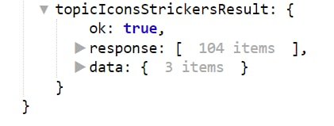
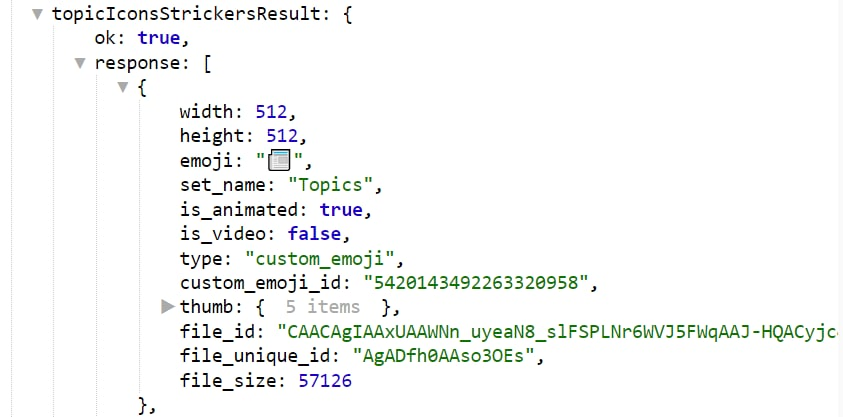

# getForumTopicIconStickers

**getForumTopicIconStickers** - Реакция запрашивает у Телеграма список доступных эмодзи для иконок тем.

::: details Подробнее



:::

На момент написания статьи доступно 104 эмодзи на выбор для ботов

В логах ID иконок будет доступен в переменной:

```plain
${topicIconsStrickersResult.response.0.custom_emoji_id}
```

Где 0 - порядковый номер объекта с эмодзи

::: details Подробнее



:::


**Method bot.api [getForumTopicIconStickers](https://core.telegram.org/bots/api#getforumtopiciconstickers)**