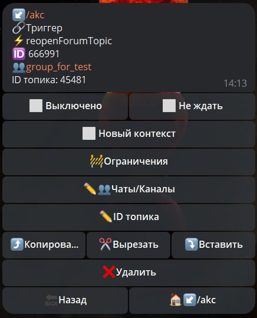

# reopenForumTopic

**reopenForumTopic** - заново открывает ранее закрытый топик.

| Функция | Описание |
| --- | --- | 
| Чаты/Каналы | Необходимо указать ID чата или ссылку на чат типа @username |
| ID топика | Название для переоткрытия топика |

**Method bot.api [reopenForumTopic](https://core.telegram.org/bots/api#reopenforumtopic)**