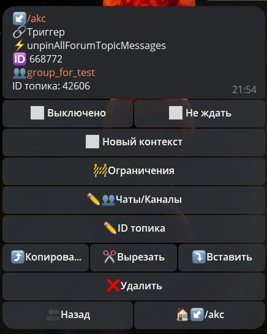

# unpinAllForumTopicMessages

**unpinAllForumTopicMessages** - реакция открепляет все сообщения в конкретном топике.

| Функция | Описание |
| --- | --- | 
| Чаты/Каналы | Необходимо указать ID чата или ссылку на чат типа @username |
| ID топика | Название для открепления постов в топика |

**Method bot.api [unpinAllForumTopicMessages](https://core.telegram.org/bots/api#unpinallforumtopicmessages)**