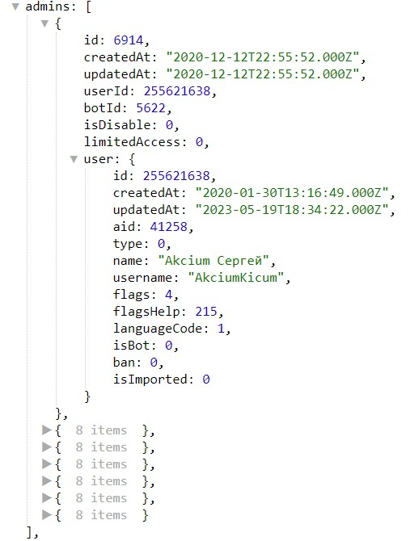

# takeAdmins
**takeAdmins** - взять (загрузить) администратора(ов) бота.

После применения комбинации реакций:

```plain
takeAdmins
— log
```

В логах будут доступны следующие переменные:

```plain
${admin}
```

* в переменной будут выведены все данные об админе, которые хранятся на сервере бота

::: details Подробнее
```json
    "admin": {
      "id": 6915,
      "createdAt": "2020-12-12T23:07:06.000Z",
      "updatedAt": "2020-12-12T23:07:06.000Z",
      "userId": 129999262,
      "botId": 5622,
      "isDisable": 0,
      "limitedAccess": 0,
      "user": {
        "id": 12345789,
        "createdAt": "2019-10-29T12:49:52.000Z",
        "updatedAt": "2023-05-30T19:14:12.000Z",
        "aid": 1,
        "type": 0,
        "name": "Zaur",
        "username": "abdulgalimov",
        "flags": 0,
        "flagsHelp": 255,
        "languageCode": 1,
        "isBot": 0,
        "ban": 0,
        "isImported": 0
      }
```
:::

---

```plain
`${admins}
``` 

* в переменной будет выведен список всех администраторов бота
::: details Подробнее

:::

---

#### Примеры использования

Отправка результатов формы администраторам бота.

::: details Подробнее

В триггере финиша формы добавляем реакции:
```plain
takeAdmins
— formResult
```
:::
--- 
Оповещение админов о запуске бота пользователем.

::: details Подробнее

* Команды - создаем новую команду: `/start`
* В триггере команды добавляем реакции:
```plain
takeAdmins
— message: !{user} запустил бота.
```
:::
---

Получить список админов.

::: details Подробнее
Создаем переменную тип "список" с названием admin:

```plain
takeAdmins
— localVarAdd тип список, admin = !{user | path: targetUser}
```

Локальная переменная с полным списком: ```${localVar.admin}```

Список админов будет доступен в разделе ```${admins...}```

К примеру если нужно указать первого админа из списка, необходимо использовать переменную: 

```${admin.0.user.name}``` - укажет полное имя админа

```${admin.0.user.name}``` - укажет его ID

Для получения остальных админов меняем 0 на 1 и далее, 2,3,4.

:::


