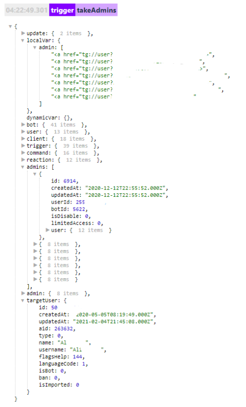

# takeAdmins
**takeAdmins** - взять (загрузить) админов бота.

**Примеры использования:**

Нам нужно отправить результат формы всем админам:

takeAdmins

— formResult

--- 
Нужно оповестить админов о том, что кто-то запустил бота.

takeAdmins

— message: _!{user}_ запустил бота.

---

Получить список админов:

takeAdmins

— localVarAdd тип список, admin = _!{user | path: targetUser}_

—  log

Локальная переменная с полным списком: _${localVar.admin}_

список админов будет доступен в разделе _${admins...}_

К примеру если нужно указать первого админа из списка, необходимо использовать переменную: 

_${admin.0.user.name}_ - укажет полное имя админа

_${admin.0.user.name}_ - укажет его ID

Для получения остальных админов меняем 0 на 1 и далее, 2,3,4.

