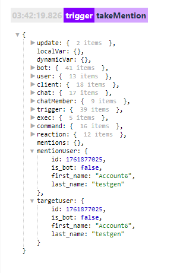

# takeMentions

**takeMentions** - взять пользователя(ей) для дальнейшей работы. 


**Примеры использования:**

Команда: /!take (.+)/i

Реакции:
```plain
— takeMentions 
— — log
```


Если необходимо исключить пользователя из чата, нам потребуется:

Команда: /!take (.+)/i

Реакции:
```plain
— takeMentions
— — takeChat ${chat.id}
— — — kickChatMember
```

---

**Особенности:**
* Работает только юзернеймами (@username) и меншенами (mention: Account6 testgen)
* Не работает с ID (123456789)

Если необходимо использовать @username и ID, подойдет:

Реакция: [takeUsers](/docs/admin/users/takeusers)


