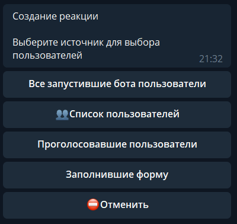

# takeRandomUser

**takeRandomUser** - взять в случайном порядке пользователей.

Предусматривает возможность выбора пользователя из 4 вариантов:

 * Все запустившие бота пользователи
 * Список пользователей
 * Проголосовавшие пользователи (выбирается определенный контент)
 * Заполнившие форму

После выбора откуда брать пользователей, можно указать количество, от 1 до 10.

По умолчанию берется 1 пользователь.

**Пример применения:**

Отправить сообщение случайным пользователям

**takeRandomUser** - все пользователи

— **sendMessage**

---

Выбрать и отобразить случайных пользователей

**takeRandomUser** - все пользователи - 2 (или более, до 10)

— **localVarAdd** - тип: список - название: rnduser - значение: _${targetUser.name}_

sendMessage: _${localVar.name}_

