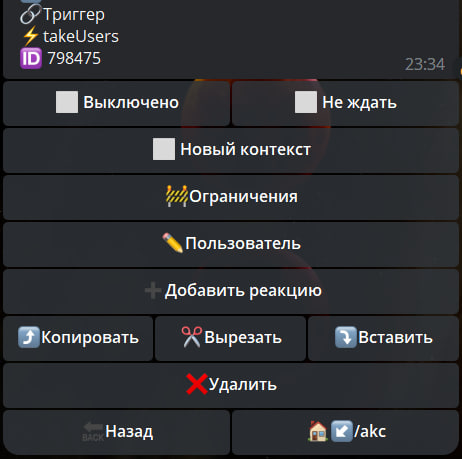

# takeUsers
**takeUsers** - загрузить пользователя для дальнейшей работы. 

Загрузить пользователя в реакции можно 3 способами:
1. ID пользователя - `123456789`
2. Юзернейм пользователя - `@username`
3. Переменной, которая будет содержать ID или username - `${user.id}` или `${user.username}`



После использования реакции, в которую мы добавили реакцию [log](/admin/other/reactions/log/), мы увидим в логах следующее:

```json
"targetUser": {
"aid": 2510065,
"id": 123456789,
"type": 0,
"name": "fullname",
"username": "username",
"flags": 0,
"flagsHelp": 16,
"languageCode": 1,
"isBot": 0,
"ban": 0,
"isImported": 0,
"createdAt": "2021-10-07T12:35:31.000Z",
"updatedAt": "2023-05-19T18:41:46.000Z"
```        

Где нам будут доступны переменные:

| Переменная               | Описание                                                      |
|--------------------------|---------------------------------------------------------------|
| `${targetUser.id}`       | ID пользователя                                               |
| `${targetUser.name}`     | (полное имя) пользователя                                     |
| `${targetUser.username}` | (или отсутствие)                                              |
| `${targetUser.isBot}`    | проверка бот это или пользователь. 0 = пользователь, 1 = бот. |


---

Пример использования реакции:

Исключение пользователя из чата:

Команда: `/!take (.+)/i`

Реакции:
```plain
— takeUsers (exec.1}
— — takeChat 
— — — kickChatMember
```

::: tip  Особенности

* Работает только юзернеймами (@username) и ID (123456789)
* Не работает c меншенами (Sergey - ссылка на пользователя без юзернейма)
* Загружает первых 200 участников

:::

Если необходимо использовать @username и меншены, подойдет:

Реакция: [takeMentions](/docs/admin/users/takementions)


