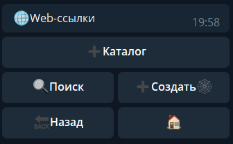
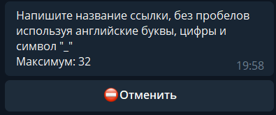
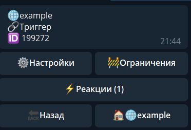

## QNext раздел WEB - ссылки

WEB - ссылки - создание кастомных (Контекстных, DeepLink)* ссылок, позволяющих обратиться к разным разделам бота (контент, меню), или же вызвать определенный ряд реакций.
* Контекстные ссылки - (альт. названия: Кастомные, Глубинные, DeepLink) — ссылки, позволяющие пользовательский переход к определённому (заданному) разделу бота, напрямую, минуя стандартные пользовательские меню. Такими ссылками удобно пользоваться, если вы хотите чтобы пользователь перешёл СРАЗУ к заданному вами разделу, минуя главное меню бота и не объясняя пользователю как найти нужный раздел.

**Рассмотрим процесс создания ссылки:**

Правила составления ссылок очень похожи на правила для составления команд, в них разрешено использовать:

Английский язык: a-z A-Z

Цифры: 1234567890

Нижний пробел: _

После создания ссылки, нам открывается следующий интерфейс:

### Интерфейс

**Ссылки**

[https://qnext.app/bin/@Qnext_Examplebot/examp1e_l1nk](https://qnext.app/bin/@Qnext_Examplebot/examp1e_l1nk) - внешняя ссылка, ее можно встроить например на вашем сайте, в блоге, или любом месте вне сервиса Телеграма.

[https://t.me/Qnext_Examplebot?start=examp1e_l1nk](https://t.me/Qnext_Examplebot?start=examp1e_l1nk) - внутренняя ссылка, работающая в пределах сервисов Телеграма (например, можно встроить в кнопку)

Кстати, ссылки рабочие. Можно по ним зайти и посмотреть :3

**Название** - позволяет изменить ссылку в любой момент (помните, изменение ссылки приведет к тому, что все ранее распространенные ссылки со старым названием прекратят работать).

🔗Триггер - как и во всех других разделах, имеет единый интерфейс, а именно: 
### Интерфейс

Настройки - статистика

[Ограничения](/docs-test/restrictions)

[Реакции](/docs-test/reactions)

[Попробовать](https://qnext.app/bin/@Qnext_Examplebot/examp1e_l1nk)

