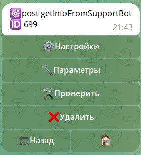
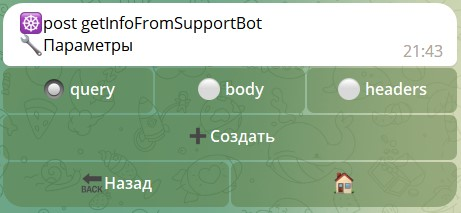
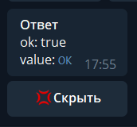
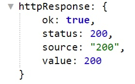

# http запросы

**http-requests** - запросы на api разных сервисов для получения от них различной информации, такой как погода, 
курсы, цены в магазине, каталоги, и другие варианты.

Создание http-запроса:

| Этап                     | Описание                                                                                            |
|--------------------------|-----------------------------------------------------------------------------------------------------|
| **Техническое название** | название видное только для администраторов.                                                         |
| **Ссылка**               | API ссылка на сервис, откуда будут браться данные.                                                  |
| **Тип запроса**          | Метод обращения к API. По умолчанию, большинство сервисов используют GET или POST.                  |
| **Формат ответа**        | Для обращения к API, требуется формат JSON. Однако, в некоторых случаях, сервис может указать TEXT. |

### Интерфейс

| Раздел                                          | Описание                        |
|-------------------------------------------------|---------------------------------|
| [Настройки](/admin/web/http-request/#настроики) | Настройки самого запроса.       |
| [Параметры](/admin/web/http-request/#параметры) | Настройки содержимого запроса.  |
| [Проверить](/admin/web/http-request/#проверить) | Выполнить запрос к API.         |
| Удалить                                         | Безвозвратное удаление запроса. |

::: details Подробнее

:::

### Настройки

Интерфейс раздела настройки полностью соответствует интерфейсу создания ссылки, позволяя изменить все пункты запроса.

::: details Подробнее

:::

### Параметры

Параметры - главный раздел API запросов. Здесь задаются все параметры и данные, которые будут отправлены API сервису. 

В этом разделе вы можете указать какие параметры передавать вместе с вашим запросом. Чтобы понять какие параметры 
и в каком виде отдавать, вам необходимо обратиться к документации того сервиса, который ожидает от вас запроса. 
Вы можете создать 3 типа параметров:

### query

Параметры типа query, это обычные который подставляются в ссылку после символа ?, и разделенные символом =. Вы просто 
создаете список нужных параметров и при выполнении запроса, бот сам добавит эти параметры в ссылку в нужном виде.
### body

Параметры типа body - это так называемые post-параметры, передать которые можно POST-запросом. Перейдя в эту вкладку, 
вы увидите дополнительные опции:

* ☑️`Шаблон body` - Позволяет указать любой текст, этот текст будет передан POST-запросом как есть.
* ☑️`Путь` - Здесь вы можете указать путь до места где лежит значением, которое необходимо передать. 
Например, если у вас в локальных переменных лежит Объект который надо передать, вы можете написать путь 
до этой переменной: `${localVar.myBodyObject}`.
* ☑️`Файл` - В этом разделе вы можете прикрепить к запросу файл.
* 
### headers

Параметры типа headers - это заголовки вашего запроса. Например, если api сервис который вы используете, ждет запрос 
в формате JSON, обычно требуется заголовок с ключом `Content-Type` и значением `application/json`.

::: details Подробнее

:::

Пример настройки реализации общения ботов на платформе:

[Подключение ботов на платформе](https://t.me/QNextCases/208)

[Настройка передачи данных между ботами](https://t.me/QNextCases/210)

#### Проверить

Пример простого `TEXT (HMTL)` ответ. 

::: details Подробнее

:::

Пример простого `JSON` ответа.

::: details Подробнее

:::