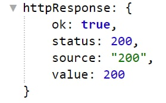

# httpRequest

**httpRequest** - использует запросы напрямую к веб-серверу и загружает данные ответа сервера. 

Полученный ответ от сервера можно увидеть, используя переменную:
 
 _${httpResponse}_

