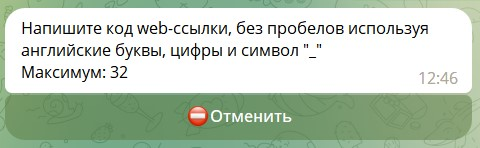
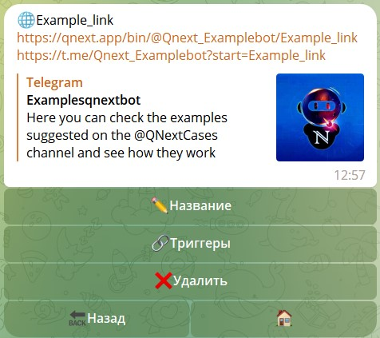

# WEB ссылки

**WEB ссылки** — создание кастомных (Контекстных, DeepLink)* ссылок, позволяющих обратиться к разным разделам бота 
(контент, меню), или же вызвать определенный ряд реакций.

Контекстные ссылки - (альт. названия: Кастомные, Глубинные, DeepLink) — ссылки, позволяющие пользовательский переход 
к определённому (заданному) разделу бота, напрямую, минуя стандартные пользовательские меню. Такими ссылками удобно 
пользоваться, если вы хотите чтобы пользователь перешёл СРАЗУ к заданному вами разделу, минуя главное меню бота и не 
объясняя пользователю как найти нужный раздел.

**Процесс создания ссылок прост:**

Правила составления ссылок очень похожи на правила для составления команд, в них разрешено использовать:

* Английский язык: `a-z` `A-Z`
* Цифры: `1234567890`
* Нижний пробел: `_`

::: details Подробнее

:::

## Интерфейс

| Функция      | Описание                                                  |
|--------------|-----------------------------------------------------------|
| **Название** | Изменение ссылки.                                         |
| **Триггер**  | Главный раздел. В этом разделе настраиваются все реакции. |

::: warning Помните

Изменение ссылки приведет к тому, что все ранее распространенные ссылки со старым названием прекратят работать.

:::

::: details Подробнее

:::

#### Ссылки

[https://qnext.app/bin/@Qnext_Examplebot/Example_link](https://qnext.app/bin/@Qnext_Examplebot/Example_link) - внешняя 
ссылка, ее можно встроить например на вашем сайте, в блоге, или любом месте вне сервиса Телеграма.

[https://t.me/Qnext_Examplebot?start=Example_link](https://t.me/Qnext_Examplebot?start=Example_link) - внутренняя 
ссылка, работающая в пределах сервисов Телеграма (например, можно встроить в кнопку)

::: tip Заметка

Ссылки рабочие. Можно нажать и проверить их работу.

:::
