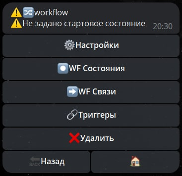
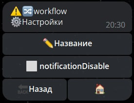
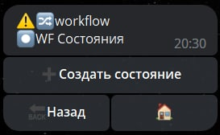
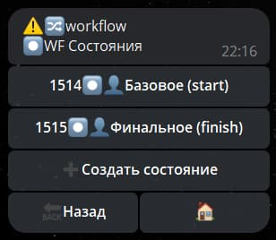
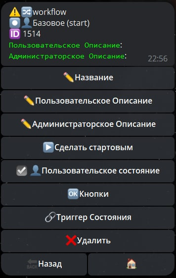
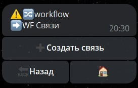
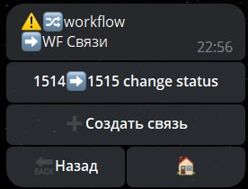
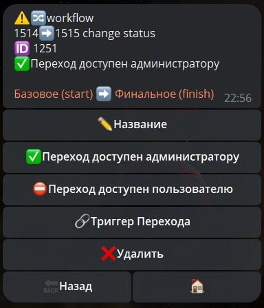

# Workflow

**Workflow** - настраиваемый механизм обработки состояния заказов в магазине или результатов заполнения формы. 
Например, можно отслеживать процесс обработки оформленного заказа: ```Принят -> Собран -> Отгружен -> Доставлен и т.д. ```
 


## Настройки



| Функция | Описание |
| --- | --- |
| Название | Редактировать название |
| notificationDisable | Отключение уведомлений о смене состояния WF |

## WF Состояния



**Состояния** - основной раздел, в котором настраиваются состояния через которые должна пройти сущность к которой подключен Workflow.

Минимальное количество состояний для работы workflow: 2 состояния, начальное (стартовое) состояние, и конечное (финальное) состояние. Стартовое состояние может быть только одно, промежуточных и финальных состояний может быть несколько, все зависит от требуемой задачи.



### Настройка состояния



| Функция | Описание |
| --- | --- |
| Название |  |
| Пользовательское Описание |  |
| Администраторское Описание |  |
| Сделать стартовым |  |
| Пользовательское состояние |  |
| Кнопки |  |
| Триггер состояния |  |
| Удалить |  |

## WF связи



Связи - создает кнопки в интерфейсе WF и определяет, какое состояние будет выбрано после нажатия на ту или иную кнопку:

* стартовое -> финальное



### Настройка связей



| Функция | Описание |
| --- | --- |
| Название |  |
| Переход доступен администратору |  |
| Переход доступен пользователю |  |
| Триггер перехода |  |
| Удалить |  |

## Триггеры
