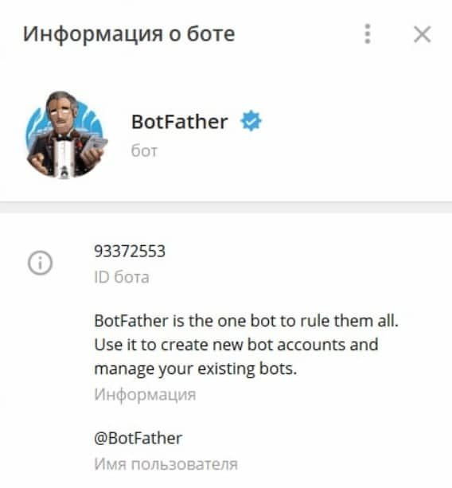
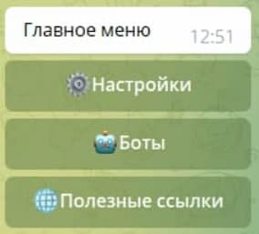
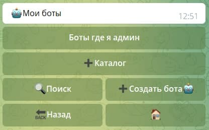
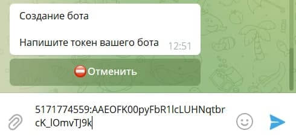
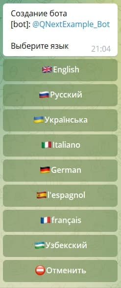
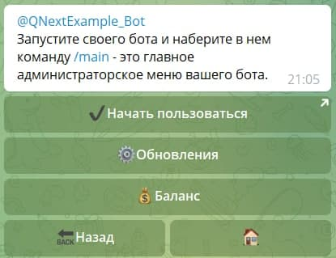

## Регистрация бота

[BotFather](http://t.me/botFather) — это официальный Telegram бот, который создает и регистрирует другие боты в мессенджере.

Вводим команду: **/newbots**

Здесь вам необходимо придумать имя вашему боту.

**Важно: Имя бота можно менять в любое время**

Следующий шаг самый важный - придумать юзернейм боту.

Здесь вам необходимо придумать юзернейм вашему будущему боту. Формат юзернейма: @Название+bot

**Важно: Юзернейм бота поменять нельзя**

Поздравляем, ваш бот зарегистрирован! 

Для привязки вашего бота к сервису [Qnextbot](http://t.me/Qnextbot) будет необходимо ввести API ключ в соответствующее окно в личном кабинете.

**API ключ — секретный код, который позволяет настроить связь с ботом вне клиента Telegram.**

Вот это наш токен: **5171774559:AAEOFK00pyFbR1lcLUHNqtbrcK_lOmvTJ9k**

## Подключение бота к QNext

Запускаем бота [Qnextbot](http://t.me/Qnextbot) и видим следующее меню

Нажимаем на кнопку **Боты**

нажимаем на кнопку **Создать бота**

В открывшемся окне вводим ранее скопированный токен

Выбираем язык на котором будет административный интерфейс бота

**Готово!** Можно приступать к работе.

