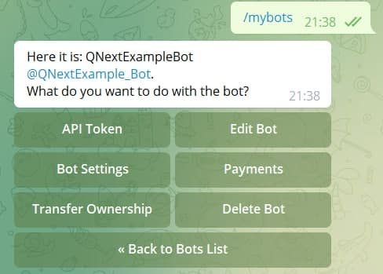
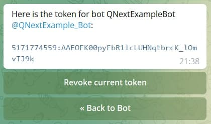
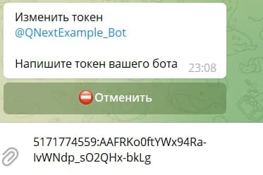

## Получение токена для имеющегося бота

Заходим в бота: **@BotFather**

Вводим команду: **/mybots**

Находим нашего бота, чей токен нужно обновить, и нажимаем на кнопку юзернеймом вашего бота. 

Здесь нас интересует кнопка: **API Token**, нажимаем, заходим в раздел.

Нажимаем на кнопку: **Revoke current token**

Получаем новый токен, его нам необходимо скопировать. 

После копирования токена, заходим в бота [Qnextbot](http://t.me/Qnextbot)

## Обновление токена

Выбираем нужного бота

Здесь нам потребуется кнопка "**Обновления**"

Видим кнопку "**Изменить токен**"

Вводим ранее скопированный токен

Готово! Вы молодцы!

