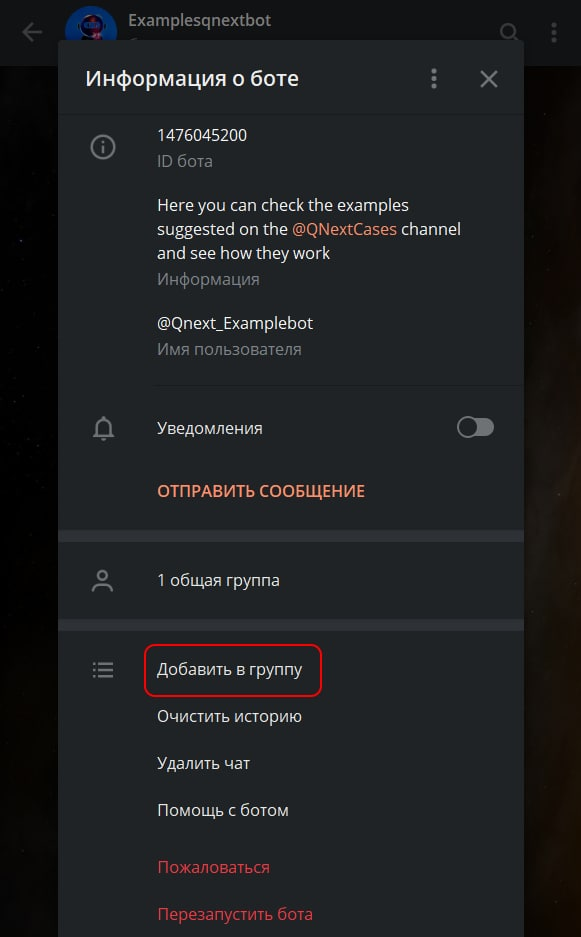
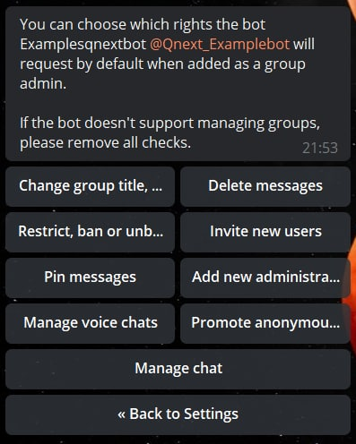
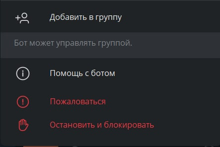
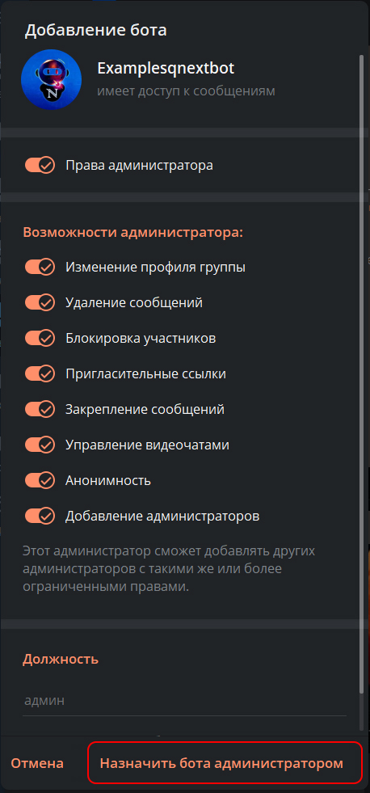

# Добавление бота в админы

В обновлении [bot.api 6.0](https://core.telegram.org/bots/api-changelog#april-16-2022) в бота [@Botfather](https://t.me/botfather)
был добавлен новый раздел для настройки бота, а именно возможность добавлять бота в чат сразу админом.
Благодаря новой функции, добавление бота в админы чата производится на несколько нажатий.

**Рассмотрим подробнее о чем идет речь**

Всем нам известен интерфейс профиля бота, в котором есть кнопка "добавить бота в чат", 
но до этой обновы его можно было добавить в чат только как участника чата.

Благодаря новому разделу можно изменить назначение этой кнопки, разрешив бота добавлять в чат сразу админом,
а так же сразу выставлять рекомендуемые права администратора для бота. Таким образом добавление и назначение бота
в админы, будет происходить в 3 нажатия:

* добавить бота
* Выбрать чат
* Подтвердить

**Рассмотрим подробнее интерфейс настройки**

Найти его можно по адресу:

* [@Botfather](https://t.me/botfather) — /mybots — выбрать бота —  Bot Settings — Group Admin Rights

В этом разделе нам доступна следующая панель для настройки:

* **Manage chat** — разрешение добавлять бота сразу в админы чата

После включения этого разрешения, в профиле бота появится новая строка:

**Остальные разрешения соответствуют стандартным правам администратора**

* **Change group title**  — Изменение профиля группы

* **Delete messages** — Удаление сообщений

* **Restrict, ban or unban** — Ограничение пользователей

* **invtite new users** — Пригласительные ссылки

* **Pin messages** — Закрепление сообщений

* **add new administrations** — Добавление администраторов

* **Manage voice chats** — Управление голосовым чатом

* **Promote anonynous admins** — выдача анонимности

**После настройки этого раздела, и нажатия на кнопку "Добавить бота", нам будет доступен новый интерфейс:**

