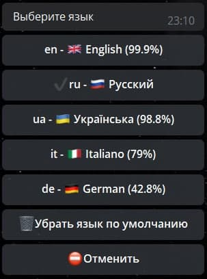
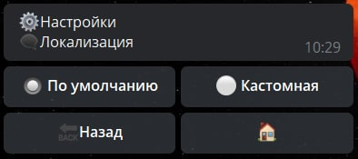
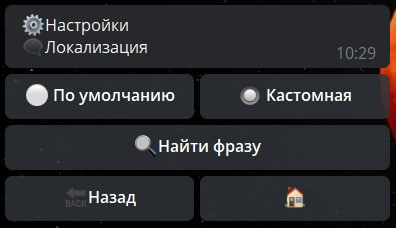
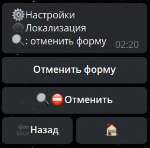
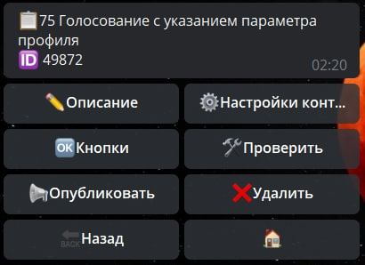
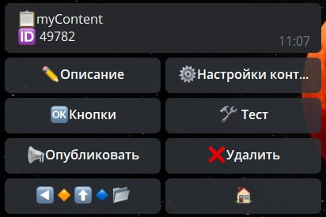

# Локализация

Платформа [QNext](https://t.me/qnextbot) имеет мультиязычную поддержку админстративного меню.

Локализация ботов на платформе [@QNextbot](https://t.me/qnextbot) разделена на 3 раздела:

[[toc]]
## Глобальная локализация 

На данный момент поддерживает следующие языков:

* Английский
* Русский
* Украинский
* Итальянский
* Немецкий

Изменение языка в [@QNextbot](https://t.me/qnextbot) переключает язык административного меню во всех ваших ботах, 
а так же отвечает за перевод всех системных кнопок, таких как:

* Отмена формы
* Предоставить номер
* Предоставить локализацию

и т.д.

## Локализация определенного бота

Локализация конкретного бота независимо от глобальной локализации в [@QNextbot](https://t.me/qnextbot).

Для этого нам потребуется реакция [setUserLanguage](/docs/admin/other/reactions/setuserlanguage) имеет наиболее высокий приоритет над глобальной локализацией. 
Иными словами в боте будет установлен язык выбранный с помощью реакции [setUserLanguage](/docs/admin/other/reactions/setuserlanguage).

Таким образом, даже если вы настраиваете всех ботов на одном конкретном языке, в в любой момент можете поменять язык любого из ваших ботов как для себя, так и для пользователей бота.

**Важно**:

**Имеет более высокий приоритет над глобальной локализацией**

## Локализация текста определенной кнопки

Кастомная локализация позволяет менять текст любой системной кнопки

**Механизм изменения текста кнопок довольно прост:**

* Выбираем кастомную локализацию
* Нажимаем "Найти фразу"
* Вводим название кнопки
* Выбираем кнопку
* Вводим свой текст
* Готово

**Пример локализации интерфейса:**

**Оригинальный интерфейс**

**Измененный текст интерфейса**
   
