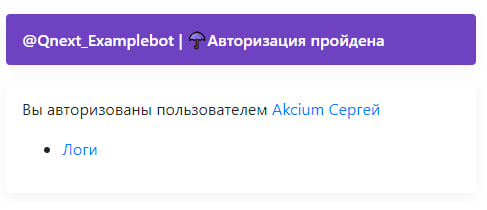

# Логи

**Логи** — раздел, отображающий все получаемые 
и создаваемые ботом данные в исходном виде. 
Все что присылает Телеграм по каждому событию,
или бот создает в триггере, 
будет в подробном виде отображено в логах.

Логи расположены в разделе [Настройки](/admin/setting/)

Прежде чем открыть страницу с логами, 
необходимо один раз пройти авторизацию в том браузере, 
в котором вы хотите смотреть логи. 
Для прохождения авторизации, необходимо зайти в раздел 
```/main -> Настройки бота -> ☂️Web-авторизация``` 
и пройти авторизацию.

::: tip  Важно!
* Необходимо именно нажать на кнопку, а не копировать ссылку. 
Телеграм запросит разрешение на предоставление данных боту. 
Подтвердите это действие и у вас откроется страница 
с информацией о том что авторизация пройдена. 

* После подтверждения сайту будут доступна 
информация из вашего профиля: имя, username, 
id и ссылка на фото профиля. 
Подробнее о процедуре телеграм-авторизации 
можно почитать в [документации telegram](https://core.telegram.org/widgets/login).
:::



После прохождения авторизации, логи вашего бота всегда 
будут доступны по адресу [qnext.app/logs](https://qnext.app/logs). 
Любой администратор вашего бота, авторизованный аналогичным 
способом, так же сможет видеть логи вашего бота. 
Одновременно логи одного бота могут смотреть несколько администраторов.

Если вы являетесь администратором нескольких ботов, вам достаточно 
один раз пройти авторизацию в любом из ваших ботов. После прохождения авторизации, 
логи всех ботов где вы являетесь администратором, будут доступны по 
ссылке типа:  ```qnext.app/logs/@UsernameBot```.

## Основы работы с логами

На скриншоте отображены 3 объекта, являющиеся базовой основой 
сопровождения любого действия в боте.


| Объект                                      | Описание                                                                                                                                |
|---------------------------------------------|-----------------------------------------------------------------------------------------------------------------------------------------|
| [**event**](/ext/log/#telegram-event)       | событие которое произошло в Телеграме, которое прислал Телеграм                                                                         |
| [**request**](/ext/log/#telegram-request)   | запрос отправляемый ботом для выполнения заданных вами методов [Telegram bot.api](https://core.telegram.org/bots/api#available-methods) |
| [**response**](/ext/log/#telegram-response) | ответ Telegram bot.api на ваш запрос, в котором будет указан результат запроса: выполнено, или отклонено                                |

#### telegram:event

**event** — json объект с необработанной информацией о произошедшем событии в 
Телеграме, отправленная в адрес бота от Телеграма.

::: details Подробнее...


Содержит следующую информацию:

| Переменная                     | Описание                                                                                         |
|--------------------------------|--------------------------------------------------------------------------------------------------|
| `${update.message.message_id}` | ID сообщения события                                                                             |
| `${update.message.from.id}`    | ID инициатора действия                                                                           |
| `${update.message.chat.id}`    | ID чата где было выполнено действие                                                              |
| `${update.message.text}`       | Текст отправленного сообщения                                                                    |
| `{update.message.date}`        | Время события, в формате Unix Timestamp. для преобразования в удобный формат, используйте макрос |
:::

#### telegram:request

**request** - сформированный ботом json объект, содержащий в себе данные о том, какой метод необходимо выполнить.

::: details Подробнее...


Содержит следующую информацию:

| Параметр  | Описание                      |
|-----------|-------------------------------|
| `path`    | название используемого метода |
| `chat_id` | чат куда отправляется запрос  |
| `text`    | содержимое запроса            |
:::

#### telegram:response

**response** - сформированный Телеграмом json объект, содержащий ответ на ранее поданный ботом запрос, в котором будет отображено, выполнен ли запрос, или отклонен.

::: details Подробнее...


Содержит следующую информацию:

| Параметр     | Описание                                                                                                            |
|--------------|---------------------------------------------------------------------------------------------------------------------|
| `result.ok`  | Самый важный параметр. Отвечает за успешность выполненного метода. true - успешно. false - ошибка                   |
| `message_id` | Отображает ID отправленного сообщения. Для удаления отправленного сообщения `${reactionResult.response.message_id}` |
| `response`   | Отображает подробности по отправленному сообщению. Инициатора, чат отправки, время отправки, содержимое.            |
| `body`       | Отображает объект с данными, который бот отправлял в запросе.                                                       |
:::

## Разбор логов

Логи имеют функцию базовой фильтрации разделов обрабатываемых данных:

| Раздел       | описание                                                                                                                               |
|--------------|----------------------------------------------------------------------------------------------------------------------------------------|
| **telegram** | Раздел отображающий все события получаемые от Telegram, а так же все запросы и ответы при работе с bot.api (update, request, response) |
| **trigger**  | Раздел отображающий результат работы log                                                                                               |
| **console**  | Системный раздел разработчика                                                                                                          |
| **pay**      | Раздел для работы с платежными системами                                                                                               |
| **webhook**  | Раздел для работы с вебхуками                                                                                                          |
| **trello**   | Раздел для работы с [Trello](https://trello.com/ru)                                                                                    |

Для отображения в логах подробной информации по определенному событию, нам потребуется реакция [Log](/admin/other/reactions/log/)


После запуска триггера, в логах будет доступна следующая информация:

::: details Подробнее

```plain
sendMessage "tet"
log
```


::: tip    Важно!
Логи могут отличаться от того, что будет в реальности, в связи с тем, что проект продолжает развиваться.
:::

## Постоянные объекты

Постоянные объекты - объект которые будут отображены в логах всегда, независимо от обстоятельств и условий

| Раздел                            | Описание                                                                                                             |
|-----------------------------------|----------------------------------------------------------------------------------------------------------------------|
| [${update...}](./#update)         | Все исходные (сырые, необработанные) данные полученные от Телеграм                                                   |
| [${localVar...}](./#localvar)     | Созданные локальные переменные в момент использования реакции [Log](/admin/other/reactions/log/)                     |
| ${dynamicalVar...}                | Созданные переменные в момент использования реакции [Log](/admin/other/reactions/log/)                               |
| ${requestType...}                 | Отправитель апдейта: telegram, webhook, trello, pay, newsletter, dashboard                                           |
| ${bot...}                         | Параметры бота                                                                                                       |
| [${user...}](./#user)             | Доступные боту сведения об инициаторе действия                                                                       |
| ${client...}                      | Параметры клиента пользователя. Все сведения в этом разделе, отдает Телеграм                                         |
| ${trigger...}                     | Параметры запущенного триггера                                                                                       |
| ${reaction...}                    | Информация о результатах выполнения реакции                                                                          |
| [${targetUser...}](./#targetuser) | Раздел доступный внутри реакции работающих с пользователем (take...): ```takeUsers/takeReplyUsers/takeAuthorUsers``` |


### ${update...}

Выводит все исходные (сырые, необработанные) данные полученные от Телеграм.

::: details Подробнее...
```json
    "update": {
      "update_id": 751605954,
      "message": {
        "message_id": 72515,
        "from": {
          "id": 1234567890,
          "is_bot": false,
          "first_name": "name",
          "last_name": "name",
          "username": "username",
          "language_code": "ru",
          "is_premium": true
        },
        "chat": {
          "id": 123456789,
          "first_name": "name",
          "last_name": "name",
          "username": "username",
          "type": "private"
        },
        "date": 1680030447,
        "text": "/cmd",
        "entities": [
          {
            "offset": 0,
            "length": 4,
            "type": "bot_command"
```

| Объект                          | Описание                                        |
|---------------------------------|-------------------------------------------------|
| `${update.message.from...}`     | Кто совершил действие                           |
| `${update.message.chat...}`     | Где совершено действие                          |
| `${update.message.date}`        | Время (в формате timestamp)                     |
| `${update.message.text}`        | Отправленный инициатором текст                  |
| `${update.message.entities...}` | Отображает подробности отправленного сообщения. |
:::

### ${localVar...}

Локальные переменные - переменные существующие до конца работы триггера.

::: details Подробнее...
```json
"localVar": {
"string": "text",
"number": 12345,
"spisok": [
"111",
"222",
"333"
],
"object": {
"aid": 41258,
"id": 123456789,
"type": 0,
"name": "name",
"username": "username",
"flags": 4,
"flagsHelp": 215,
"languageCode": 1,
"isBot": 0,
"ban": 0,
"isImported": 0,
"createdAt": "2020-01-30T13:16:49.000Z",
"updatedAt": "2023-05-19T18:34:22.000Z"
}
``` 

| Объект             | Тип | Описание |
|--------------------|--|----------|
| `${localVar.string}` | строка |  Значение переменной тип строка        |
| `${localVar.number}` | число |   Значение переменной тип число       |
| `${localVar.spisok}` | список | Значение переменной тип список         |
| `${localVar.object}` | объект |  Значение переменной тип объект |

:::

### ${user...}

Выводит доступную информацию об инициаторе действия.

::: details Подробнее...
```json
    "user": {
      "aid": 41258,
      "id": 123456789,
      "type": 0,
      "name": "name",
      "username": "name",
      "flags": 4,
      "flagsHelp": 215,
      "languageCode": 1,
      "isBot": 0,
      "ban": 0,
      "isImported": 0,
      "createdAt": "2020-01-30T13:16:49.000Z",
      "updatedAt": "2022-10-24T12:09:47.000Z"
```

| Переменная         | Описание                          |
|--------------------|-----------------------------------|
| `${user.id}`       | ID пользователя                   |
| `${user.name}`     | имя пользователя                  |
| `${user.username}` | юзернейм пользователя (@username) |
:::

### ${targetUser...}

Выводит информацию о выбранном пользователе. По умолчанию выводит инициатора, если не использованы реакции типа take: ```takeUsers/takeReplyUsers/takeAuthorUsers```

::: details Подробнее...
```json
    "targetUser": {
      "aid": 41258,
      "id": 255621638,
      "type": 0,
      "name": "Akcium Сергей",
      "username": "AkciumKicum",
      "flags": 4,
      "flagsHelp": 215,
      "languageCode": 1,
      "isBot": 0,
      "ban": 0,
      "isImported": 0,
      "createdAt": "2020-01-30T13:16:49.000Z",
      "updatedAt": "2022-10-24T12:09:47.000Z"
```

| Переменная               | Описание                          |
|--------------------------|-----------------------------------|
| `${targetUser.id}`       | ID пользователя                   |
| `${targetUser.name}`     | имя пользователя                  |
| `${targetUser.username}` | юзернейм пользователя (@username) |
:::

## Динамические (зависимые)  объекты

**Объекты формируются только при выполнении определенных условий и являются необязательными при формировании логов.**

| Раздел                                    | Описание                                                                                                                                                                                                                 |
|-------------------------------------------|--------------------------------------------------------------------------------------------------------------------------------------------------------------------------------------------------------------------------|
| ${command...}                             | Раздел, отвечающий за параметры запущенной команды.                                                                                                                                                                      |
| ${exec...}                                | Раздел вызываемый с помощью регулярных выражений типа: /(.+)/i                                                                                                                                                           |
| ${userAction...}                          | Раздел вызывается при запуске отложенного действия                                                                                                                                                                       |
| ${fieldValue...}                          | Раздел доступен после прохождения поля Формы. Отображает параметры последнего пройденного поля. Удобен, если нужно в теле вопроса формы, указать ответ в предыдущем поле.                                                |
| [${formResult...}](./#formresult)         | Раздел отображается во время окончания формы в триггере финиша                                                                                                                                                           |
| ${fieldValue...}                          | Раздел отображается в триггере подготовки поля. Здесь можно увидеть, что пользователь ввел в поле. Функция необходима для того, что б ответ пользователя в прошлом поле, отобразить в следующем (или, в необходимом вам. |
| ${pay...}                                 | Раздел вызывается во время запуска платежа и во время успешной оплаты (или тестового платежа)                                                                                                                            |
| [${reactionResult...}](./#reactionresult) | Раздел, доступный в течение одной реакции после реакций типа send... ```(sendmessage, sendMenu, sendContent)```                                                                                                          |
| [${scriptResult...}](./#scriptresult)     | Раздел, доступный после реакции runScript                                                                                                                                                                                |
| [${serviceMessage...}](./#servicemessage) | Раздел, доступный после получения ботом сообщения о публикации нового системного сообщения Телеграмом                                                                                                                    |

### ${formResult...}

Объект с данными будет доступен в триггере финиша формы.

::: details Подробнее...
```json
    "formResult": {
      "fieldsText": "text: text\nnumber: 123456789",
      "previewUrl": null,
      "topMediaFile": null,
      "values": {
        "text": "text",
        "number": 123456789
      },
      "data": {
        "text": {
          "id": 5099606,
          "createdAt": "2023-03-28T20:35:53.000Z",
          "updatedAt": "2023-03-28T20:35:53.000Z",
          "botId": 5622,
          "userId": 123456789,
          "formId": 6156,
          "formDataId": 3988706,
          "fieldId": 49475,
          "text": "text",
          "latitude": "",
          "longitude": "",
          "number": 0,
          "floatNumber": 0,
          "fileId": null,
          "fileType": null,
          "buttonId": null,
          "contentId": 0,
          "isSkipped": 0,
          "salt": 0,
          "payOrderId": 0
        },
        "number": {
          "id": 5099607,
          "createdAt": "2023-03-28T20:35:56.000Z",
          "updatedAt": "2023-03-28T20:35:56.000Z",
          "botId": 5622,
          "userId": 1234567890,
          "formId": 6156,
          "formDataId": 3988706,
          "fieldId": 49476,
          "text": null,
          "latitude": "",
          "longitude": "",
          "number": 123456789,
          "floatNumber": 0,
          "fileId": null,
          "fileType": null,
          "buttonId": null,
          "contentId": 0,
          "isSkipped": 0,
          "salt": 0,
          "payOrderId": 0
```

Форма, единственный и уникальный раздел, который отображает введенные пользователем данные в 2‑х форматах:

* `formResult.values` - выводит уже обработанные данные, готовые для публикации.
* `formResult.data` - выводит сырые, исходные, не обработанные данные в исходном виде.

| Переменная                         | Описание                                           |
|------------------------------------|----------------------------------------------------|
| `${formResult.fieldsText}`         | Выведет все, что вводил (или выбирал) пользователь |
| `${formResult.values.text}`        | Выведет параметр отдельного поля text              |
| `${formResult.data.number.number}` | Выведет значение отдельного поля number            |
:::

Подробнее можно изучить по ссылкам:

[Видео-инструкция как работать с логами в форме](https://youtu.be/3tm1ARN_G7g)

[Текстовая инструкция как работать с логами в форме](https://t.me/QNextCases/120) 

### ${reactionResult...}

Объект будет доступен после выполнения реакции, в объекте будут выведены подробности выполненной реакции.

::: details Подробнее...
```json
    "reactionResult": {
      "ok": true,
      "response": {
        "message_id": 72553,
        "from": {
          "id": 1476045200,
          "is_bot": true,
          "first_name": "Examplesqnextbot",
          "username": "Qnext_Examplebot"
        },
        "chat": {
          "id": 1234567890,
          "first_name": "name",
          "last_name": "name",
          "username": "username",
          "type": "private"
        },
        "date": 1680089783,
        "text": "text"
      },
      "data": {
        "url": "https://api.telegram.org/bot1234567890:ABCDEFGHIJKLMNOPQRSTUVWXYZ/sendMessage",
        "body": {
          "parse_mode": "HTML",
          "chat_id": 1234567890,
          "text": "text"
        },
        "files": null
```

| Переменная                              | Описание                                                |
|-----------------------------------------|---------------------------------------------------------|
| `${reactionResult.response.message_id}` | - ID отправленного сообщения                            |
| `${reactionResult.response.from...}`    | - хранит сведения об инициаторе отправленного сообщения |
| `${reactionResult.response.chat...}`    | - хранит сведения о чате куда отправлено сообщение      |
:::

### ${scriptResult...}

Объект с подробностями выполненного скрипта будет доступен после выполнения реакции [runScript](/admin/other/reactions/runscript/)

::: details Подробнее...
```json
    "scriptResult": {
      "ok": true,
      "out": {
        "sum": 30,
        "diff": 10,
        "multiply": 200,
        "return": 200
      },
      "exports": {},
      "triggerFlow": {
        "break": false,
        "breakGroup": false,
        "return": false
      },
      "cacheDiff": {
        "deleteList": [],
        "addedData": {}
      },
      "stats": {
        "leadTimeMS": 6
```

| Переменная                         | Описание                                         |
|------------------------------------|--------------------------------------------------|
| `${scriptResult.out.sum}`          | Сумма чисел                                      |
| `${scriptResult.out.diff}`         | Разница чисел                                    |
| `${scriptResult.out.multiply}`     | Произведение чисел                               |
| `${scriptResult.stats.leadTimeMS}` | Длительность выполнения скрипта в миллисекундах. |
:::


### ${serviceMessage...}

Системные сообщения в чате о разных событиях


Список доступных сервисных сообщений:
| Номер | Название | Описание |
| --- | --- | --- |
| 1 | `leftChatMember` | Выход из чата |
| 2 | `newChatMembers` | Вход в чат |
| 3 | `newChatPhoto` | Изменено фото чата |
| 4 | `deleteChatPhoto` | Удалено фото чата |
| 5 | `newChatTitle` | Изменено название чата |
| 6 | `pinnedMessage` | Закреплено сообщение |
| 7 | `messageAutoDeleteTimerChanged` | Таймер автоудаления |
| 8 | `voiceChatStarted` | Голосовой чат запущен |
| 9 | `voiceChatEnded` | Голосовой чат закончен |
| 10 | `voiceChatParticipantsInvited` | Пользователь приглашен в голосовой чат |
| 11 | `voiceChatScheduled` | Голосовой чат запланирован |

## Полезное

::: tip Полезно

* Количество реакций log не ограничено на триггер
* Если вам нужно посчитать количество объектов в массиве, можно использовать переменную:

`${update.message.entities.length}` — где:
`${update.message.entities...}` — путь до массива
`${.....length}` — счетчик количества элементов в массиве 


* В логах работает поиск по полному совпадению, а так же по сущностям и по логике.

Примеры: 

* \$ `chat.id` = -1001000000000 - будут отображены логи в которых есть указанный параметр
* \$ `chat.id` = -1001000000000 or `update.message.chat.id` = -1001000000000 - будут отображены логи в которых есть один из параметров.
* \$ `chat.id` = -1001000000000 and `update.message.chat.id` = -1001000000000 - будут отображены логи, в которых есть оба параметра. 
:::

## Видео-инструкции

[Видео инструкция как работать с логами](https://youtu.be/7aWbBXHSsj8)

[Видео инструкция как работать с логами в форме](https://youtu.be/3tm1ARN```G7g)

[Видео инструкция как работать с логами с использованием takeMention](https://youtu.be/pJcQ1nAWUmI)


