# Логи

**Логи** — раздел, отображающий все получаемые и создаваемые ботом данные в исходном виде. 
Все что присылает Телеграм по каждому событию будет в подробном виде будет отображено в логах.

Логи расположены в разделе [Настройки](/admin/setting/)

Прежде чем открыть страницу с логами, необходимо один раз пройти авторизацию в том браузере, в котором вы хотите смотреть логи. 
Для прохождения авторизации, необходимо зайти в раздел ```/main -> Настройки бота -> ☂️Web-авторизация``` и пройти авторизацию.

::: tip    Важно!
* Необходимо именно нажать на кнопку, а не копировать ссылку. 
Телеграм запросит разрешеие на предоставление данных боту. 
Подтвердите это действие и у вас откроется страница с информацией о том что авторизация пройдена. 

* После подтверждения сайту будут доступна информация из вашего профиля: имя, username, id и ссылка на фото профиля. 
Подробнее о процедуре телеграм-авторизации можно почитать в [документации telegram](https://core.telegram.org/widgets/login).
:::

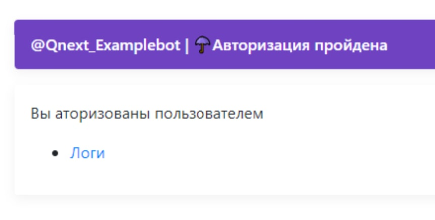

После прохождения авторизации, логи вашего бота всегда будут доступны по адресу [qnext.app/logs](https://qnext.app/logs). 
Любой администратор вашего бота, авторизованный аналогичным способом, так же сможет видеть логи вашего бота. 
Одновременно логи одного бота могут смотреть несколько администраторов.

Если вы являетесь администратором нескольких ботов, вам достаточно один раз пройти авторизацию в любом боте. После прохождения авторизации, логи всех ботов где вы являетесь администратором, будут доступны по ссылке типа:  ```qnext.app/logs/@BotUsername```.

## Основы работы с логами

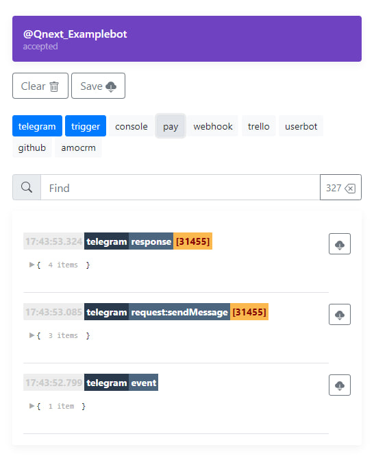

На скриншоте отображены 3 объекта, являющиеся базовой основой сопровождения любого действия в боте.

| Объект | Описание |
| --- | --- |
| [**event**](/ext/log/#telegram-event) | событие которое произошло в Телеграме, которое прислал Телеграм |
| [**request**](/ext/log/#telegram-request) | запрос отправляемый ботом для выполнения заданных вами методов [Telegram bot.api](https://core.telegram.org/bots/api#available-methods) |
| [**response**](/ext/log/#telegram-response) | ответ Telegram bot.api на ваш запрос, в котором будет указан результат запроса: выполнено, или отклонено |

#### telegram:event

**event** — объект с необработанной информацией о произошедшем событии в Телеграме, отправленная в адрес бота от Телеграма.

Пример события:

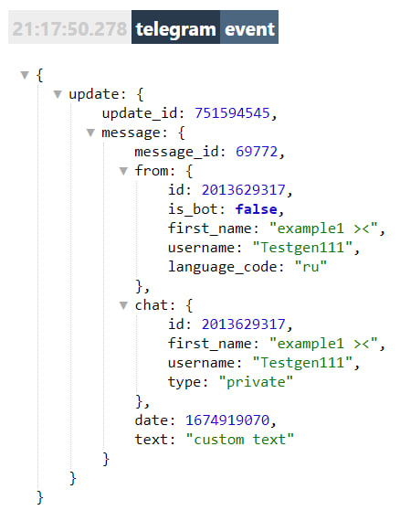

Содержит следующую информацию:

* ID события
* Инициатор запуска события
* Чат, где произошло событие
* Время когда произошло событие в формате timestamp

#### telegram:request

**request** - сформированный ботом объект, содержащий в себе данные о том, выполнение какого метода выполняется.

Пример запроса:

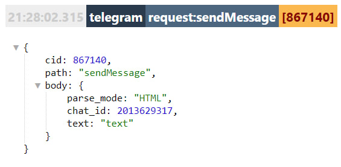

Содержит следующую информацию:

* название используемого метода
* чат куда отправляется запрос 
* содержимое запроса

#### telegram:response

**response** - сформированный Телеграмом объект, содержащий ответ на ранее поданный ботом запрос, в котором будет отображено, выполнен ли запрос, или отклонен.

Пример запроса:

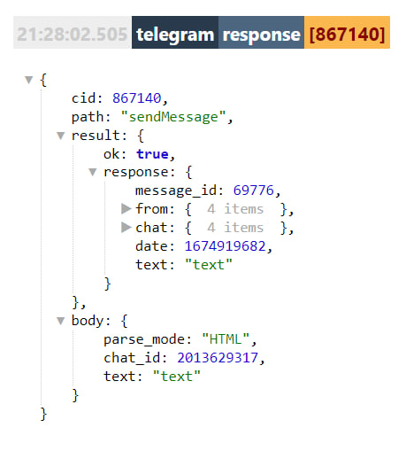

Содержит следующую информацию:

* название запрошенного метода
* результат: успешно или ошибка
* содержимое запроса

## Углубленная работа с логами

Логи имеют функцию базовой фильтрации разделов обрабатываемых данных:

| Раздел | описание |
| --- | --- |
| **telegram** | Раздел отображающий все события получаемые от Telegram, а так же все запросы и ответы при работе с bot.api (update, request, response) |
| **trigger** | Раздел отображающий результат работы log |
| **console** | Системный раздел разработчика |
| **pay** | Раздел для работы с платежными системами |
| **webhook** | Раздел для работы с вебхуками  |
| **trello** | Раздел для работы с [Trello](https://trello.com/ru) |

Для отображения в логах подробной информации по определенному событию, нам потребуется реакция [Log](/admin/other/reactions/log/)

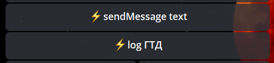

После запуска триггера, в логах будет доступна следующая информация:


## Постоянные объекты

| Раздел | Описание |
| --- | --- |
| [${update...}](/ext/#update) | Все исходные (сырые, необработанные) данные полученные от Телеграм |
| ${localVar...} | Созданные локальные переменные в момент использования реакции [Log](/admin/other/reactions/log/) |
| ${dynamicalVar...} | Созданные переменные в момент использования реакции [Log](/admin/other/reactions/log/) |
| ${requestType...} | Отправитель апдейта: telegram, webhook, trello, pay, newsletter, dashboard |
| ${bot...} | Параметры бота |
| [${user...}](/ext/log/#user) | Доступные боту сведения об инициаторе действия |
| ${client...} | Параметры клиента пользователя. Все сведения в этом разделе, отдает Телеграм  |
| ${trigger...} | Параметры запущенного триггера |
| ${reaction...} | Информация о результатах выполнения реакции |
| ${targetUser...} | Раздел доступный внутри реакции работающих с пользователем (take...): ```takeUsers/takeReplyUsers/takeAuthorUsers``` |


#### ${update...}

Выводит все исходные (сырые, необработанные) данные полученные от Телеграм


* Кто совершил действие - ```${update.message.from...}```
 
 ```${update.message.from.fullName}``` = **John seena**

* Где совершено действие - ```${update.message.chat...}```

 ```${update.message.chat.title}``` = **Examples_qnext**

* Время (в формате timestamp) - ```${update.message.date}```
 
 ```${update.message.date}``` = **1630614655**

* Отправленный текст - ```${update.message.text}```

 ```${update.message.text}``` = **/akc**

* Вложения (медиа) - ```${update.message.entities...}```

 ```${update.message.entities.0.type}``` = **bot_command**

#### ${user...}

Выводит доступную информацию об инициаторе действия (полное имя, ID, и прочие данные)

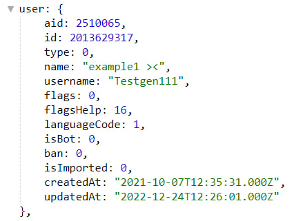

— ```${user.id}``` - ID пользователя

— ```${user.name}``` - имя пользователя

— ```${user.username}``` - юзернейм пользователя (@username)

#### ${targetUser...}

Выводит информацию о выбранном пользователе. По умолчанию выводит инициатора, если не использованы реакции типа take: ```takeUsers/takeReplyUsers/takeAuthorUsers```

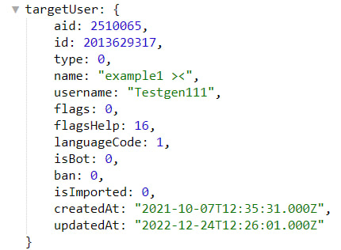

— ```${targetUser.id}``` - ID пользователя

— ```${targetUser.name}``` - полное имя пользователя

— ```${targetUser.username}``` - юзернейм пользователя (@username}


## Динамические (зависимые)  объекты

**Объекты появляются только после выполнения определенных действий.** 

::: tip    Важно!
Логи могут отличаться от того, что будет в реальности, в связи с тем, что проект продолжает развиваться
:::

| Раздел | Описание |
| --- | --- |
| ${command...} | Системный раздел, отвечающий за параметры запущенной команды. |
| ${exec...} | Раздел вызываемый с помощью регулярных выражений типа: /(.+)/i |
| ${userAction...} | Раздел вызывается при запуске отложенного действия |
| ${fieldValue...} | Раздел доступ после прохождения поля Формы. Отображает параметры последнего пройденного поля. Удобен, если нужно в теле вопроса формы, указать ответ в предыдущем поле. |
| [${formResult...}](/ext/log/#formresult) | Раздел отображается во время окончания формы в триггере финиша |
| ${fieldValue...} | Раздел отображается в триггере подготовки поля. Здесь можно увидеть, что пользователь ввел в поле. Функция необходима для того, что б ответ пользователя в прошлом поле, отобразить в следующем (или, в необходимом вам. |
| ${pay...} | Раздел вызывается во время запуска платежа и во время успешной оплаты (или тестового платежа) |
| [${reactionResult...}](/ext/log/#reactionResult) | Раздел, доступный в течение одной реакции после реакций типа send... ```(sendmessage, sendMenu, sendContent)``` |
| [${scriptResult...}](/ext/log/#scriptResult) | Раздел, доступный после реакции runScript |
| [${serviceMessage...}](/ext/log/#serviceMessage) |  |

#### ${formResult...}

Объект будет доступен в триггере финиша формы

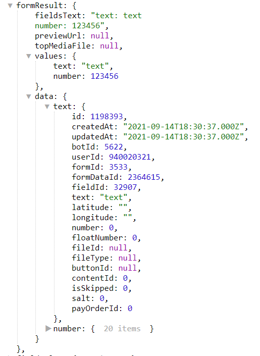

— ```${formResult.fieldsText}``` - содержит все что вводил (или выбирал) пользователь

— ```${formResult.values.text}``` - содержит параметр отдельного поля text

— ```${formResult.values.number}``` - содержит значение отдельного поля number.

Подробнее можно изучить ниже:

[Видео-инструкция как работать с логами в форме](https://youtu.be/3tm1ARN_G7g)

[Текстовая инструкция как работать с логами в форме](https://t.me/QNextCases/120) 

#### ${reactionResult...}

Объект будет доступен после выполнения реакции, в объекте будут выведены подробности.

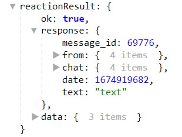

— ```${reactionResult.response.message_id}``` - ID отправленного сообщения

— ```${reactionResult.response.from...}``` - хранит сведения об инициаторе отправленного сообщения

— ```${reactionResult.response.chat...}``` - хранит сведения о чате куда отправлено сообщение

#### ${scriptResult...}

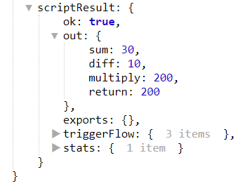

— Сумма: ```${scriptResult.out.sum}```

— Разница: ```${scriptResult.out.diff}```

— Произведение: ```${scriptResult.out.multiply}```

#### ${serviceMessage...}

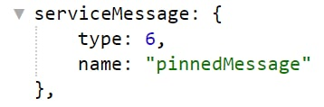


— '1': ```leftChatMember```

— '2': ```newChatMembers```

— '3': ```newChatPhoto```

— '4': ```deleteChatPhoto```

— '5': ```newChatTitle```

— '6': ```pinnedMessage```

— '7': ```messageAutoDeleteTimerChanged```

— '8': ```voiceChatStarted```

— '9': ```voiceChatEnded```

— '10': ```voiceChatParticipantsInvited```

— '11': ```voiceChatScheduled```

## Полезное

* Количество реакций log не ограничено на триггер

* Если вам нужно посчитать количество объектов в массиве, можно использовать переменную:

```${update.message.entities.length}``` - где:

```${update.message.entities...}```  путь до массива

```${.....length}``` - счетчик количества элементов в массиве 

* В логах работает поиск по полному совпадению, а так же по сущностями и по логике.

Примеры: 

* \$ chat.id = -1001000000000 - будут отображены логи только в которых есть совпадение указанного параметра

* \$ chat.id = -1001000000000 or update.message.chat.id = -1001000000000

## Видео-инструкции

[Видео инструкция как работать с логами](https://youtu.be/7aWbBXHSsj8)

[Видео инструкция как работать с логами в форме](https://youtu.be/3tm1ARN```G7g)

[Видео инструкция как работать с логами с использованием takeMention](https://youtu.be/pJcQ1nAWUmI)


