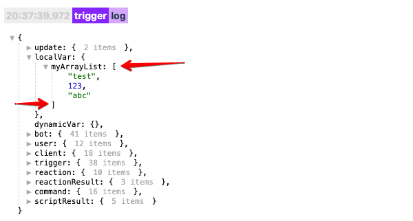

# !{array|...}
Макрос `!{array}` позволяет делать различные манипуляции со списками(массивами, Array в терминологии JavaScript). Для работы с этим макросом, у вас должен где то лежать список(массив) элементов. Это может быть локальная или глобальная переменная, или какой то результат выполнения скрипта. Найти список(массив) можно в логах. В логах списки(массивы) помечаются квадратными скобками `[ ... ]`:



В этом примере у нас в `localVar` переменных лежит локальная переменная `myArrayList`, которая является список, и в этом списке у нас 3 элемента:
1 текст "test"
2 число 123
3 текст "abc"

Чтобы ботом вывести например количество элементов этого списка, вы можете воспользоваться макросом:
```plain 
!{array|
  path: localVar.myArrayList;
  type: length;
}
```

Макрос выполняет различные действия, в зависимости от значения параметра `type`:

[[toc]]

## type: length

Количество элементов в списке:
```plain 
!{array|
  path: localVar.myArrayList;
  type: length;
}
```
## type: indexOf

Найти номер позиции элемента в списке. Например вы хотите найти в какой позиции находит текст `"abc"`:
```plain 
!{array|
  path: localVar.myArrayList;
  type: indexOf;
  element: abc;
}
```

Макрос вернет значение `2`, потому что позиционирование элементов в массиве начинается не с `1` с номера `0`.

## type: lastindexof

Тоже самое что и `type: indexOf`, только поиска начинается с конца массива:
```plain 
!{array|
  path: localVar.myArrayList;
  type: lastIndexOf;
  element: abc;
}
```


## type: join

Преобразовывает массив в строку, разделяя элементы разделителем. 
```plain 
!{array|
  path: localVar.myArrayList;
  type: join;
  separator: @;
}
```

В этом примере мы использовали в качестве разделителя символ @, значит на выходе мы получим вот такую строку:
```plain 
test@123@abc
```

Если вы хотите использовать в качестве разделителя пробел, или переход строки, воспользуйтесь [спец символами](/docs/ext/macros).


## type: at

Возвращает элемент массив по указанному номеру. Например вы хотите получить из массива элемент с номером `1`:
```plain 
!{array|
  path: localVar.myArrayList;
  type: at;
  index: 1;
}
```

Макрос вернет значение `123`. Не забывайте что нумерация в массиве начинается не с `1` а с `0`.

