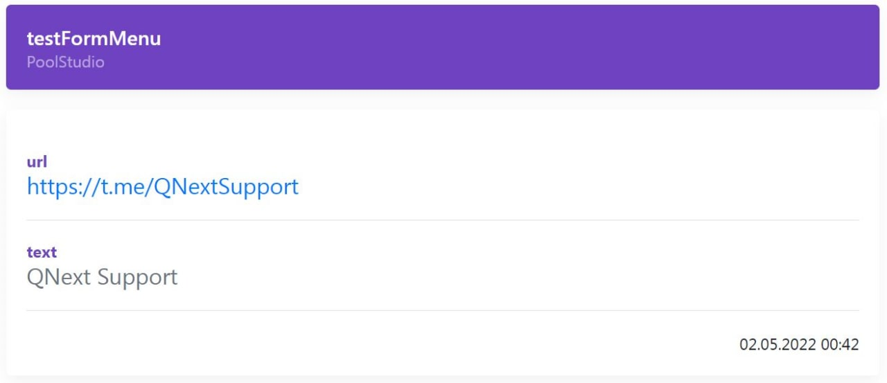

# !{makelink|...}

Макрос `!{makelink}` - Можно просматривать результаты формы в браузере, в таком виде:

Такую ссылку можно получить в меню администратора в разделе просмотра результата формы. Так же такую ссылку можно сформировать с помощью макроса:
!{makeLink| type: formResult}.
Макрос будет работать только если в текущем триггере доступна переменная: ${formData}.