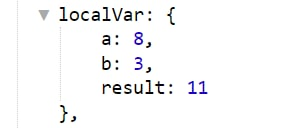
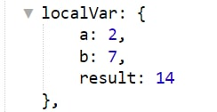
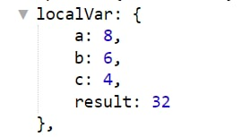
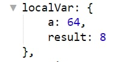
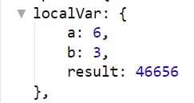

# !{script|...}

Макрос `!{script}` позволяет производить простые расчеты. 

Создайте реакцию ⚡️message с текстом:

`Результат: !{script| code: 5 * 6}`

Вы увидите результат умножения 30.  Макрос выводит результат последнего выражения в скрипте.

Если в ходе произошла ошибка, вместо результата будет отображен текст ошибки. Если вы не хотите своим пользователям показывать текст JavaScript-ошибки, вы можете передать параметр `errorText`:
```plain 
Результат: !{script|
    code: 5 * a;
    errorText: Ошибка в коде;
}
```

Как видите, в qnext-макросах символ точка запятая ";" используется по умолчанию как разделитель параметров. Это значит что если вы в коде будете использовать символ ; вы получите ошибку. Чтобы этого избежать, необходимо макросу указать что разделителем параметров должен выступать другой символ, например символ |:
```plain 
Результат: !{script|ps(|)
  code: var a = 5;
        var b = 6;
        a * b; |
  errorText: Ошибка в коде|
}
```

Если вам необходимо написать сложный скрипт с такими инструкциями как if, for используя фигурные скобки, воспользуйтесь реакцией ⚡ [runScript](/admin/other/reactions/runscript/)

### Примеры скриптов
---
### Пример 1: Сложение

⚡ localVarSet — число — a — 
```plain 
!{random|
  type: number;
  min: 1;
  max: 9;
} 
```

⚡ localVarSet — число — b — 
```plain 
!{random|
  type: number;
  min: 1;
  max: 9;
} 
```
⚡ localVarSet — число — result = 
```plain 
!{script|
  code: qnext.getValue("localVar.a",0) + qnext.getValue("localVar.b",0); errorText:0}
```

**Логи**



---

### Пример 2: умножение

⚡ localVarSet — число — a — 
```plain 
!{random|
  type: number;
  min: 1;
  max: 9;
} 
```

⚡ localVarSet — число — b — 
```plain 
!{random|
  type: number;
  min: 1;
  max: 9;
} 
```
⚡ localVarSet — число — result = 
```plain 
!{script|
  code: qnext.getValue("localVar.a",0) * qnext.getValue("localVar.b",0); errorText:0}
```

**Логи**



---

### Пример 3: смешанные расчеты

⚡ localVarSet — число — a — 
```plain 
!{random|
  type: number;
  min: 1;
  max: 9;
} 
```

⚡ localVarSet — число — b — 
```plain 
!{random|
  type: number;
  min: 1;
  max: 9;
} 
```

⚡ localVarSet — число — c — 
```plain 
!{random|
  type: number;
  min: 1;
  max: 9;
} 
```

⚡ localVarSet — число — result = 
```plain 
!{script|
  code: qnext.getValue("localVar.a",0) + qnext.getValue("localVar.b",0) * qnext.getValue("localVar.c",0); errorText:0}
```

**Логи**



---

### Пример 4: Квадратный корень числа

⚡️ localVarSet — число — a = 64

⚡ localVarSet — число — result = 
```plain 
!{script|
  code: Math.sqrt(qnext.getValue("localVar.a",1)); errorText:0}
```

**Логи**



---

### Пример 5: Возведение в степень b числа a

⚡ localVarSet — число — a = 8 

⚡ localVarSet — число — b = 2 

⚡ localVarSet — число — result = 
```plain 
!{script|
  code: Math.pow(qnext.getValue("localVar.a",1), qnext.getValue("localVar.a",1)); errorText:0}
```

**Логи**

