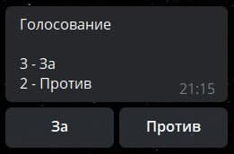
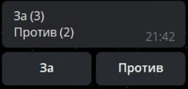
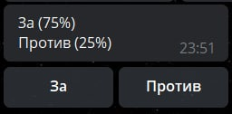
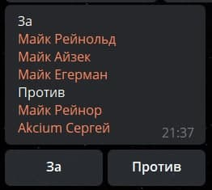
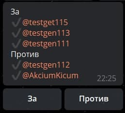
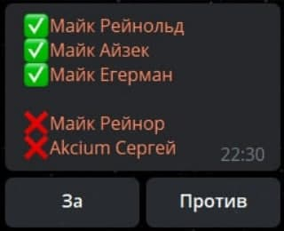
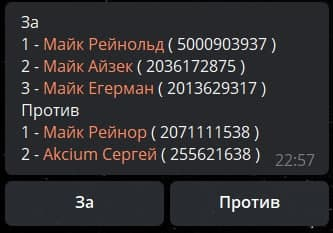
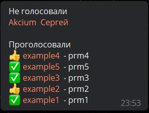

# Готовые примеры макроса !{vote|...}

### Пример 1

```plain 
!{vote| type: results}
```



---

```plain 
!{vote|
 type:results;
 template: $title ($count);
}
```



---

```plain
!{vote|
 type:results;
 template: $title ($percent%);
}
```



---

```plain 
!{vote|
  type: users ; 
  userView: name;
  userLink: default;
  splitterUser: \n;
  splitterButton: \n;
}
```



---

```plain
!{vote|
  type: users ; 
  userView: username;
  userPrefix: ✔️;
  userLink: default;
  splitterUser: \n;
  splitterButton: \n;
}
```



---

```plain
!{vote|
  type: users ; 
  userView: name;
  userPrefix: ✅;
  userLink: default;
  splitterUser: \n;
  splitterButton: \n;
  button: 000000;
}

!{vote|
  type: users ; 
  userView: name;
  userPrefix: ❌;
  userLink: default;
  splitterUser: \n;
  splitterButton: \n;
  button: 000000;
}
```



---

```plain
!{vote|
  type: users ; 
  userView: name;
  userLink: default;
  userTemplate: $index - $user ( $userId );
  splitterUser: \n;
  splitterButton: \n;
}
```



---

```plain
!{vote| 
  type: count;
  where: buttons;
  buttons: 000000;
}

!{vote| 
  type: count;
  where: buttons;
  buttons: 000000;
}
```

 

---

```plain
Не голосовали
!{vote|
  type: userList;
  usersListId: 0000 ;
  notVotedTemplate: $user; 
  userView: name;
  filter: notVoted;
  profileId: 0000 ;
}

Проголосовали
!{vote|
  type: userList;
  usersListId: 0000 ;
  votedTemplate: $description $user  - $profile;
  userView: name;
  filter: voted;
  profileId: 0000 ;
}
``` 

 

