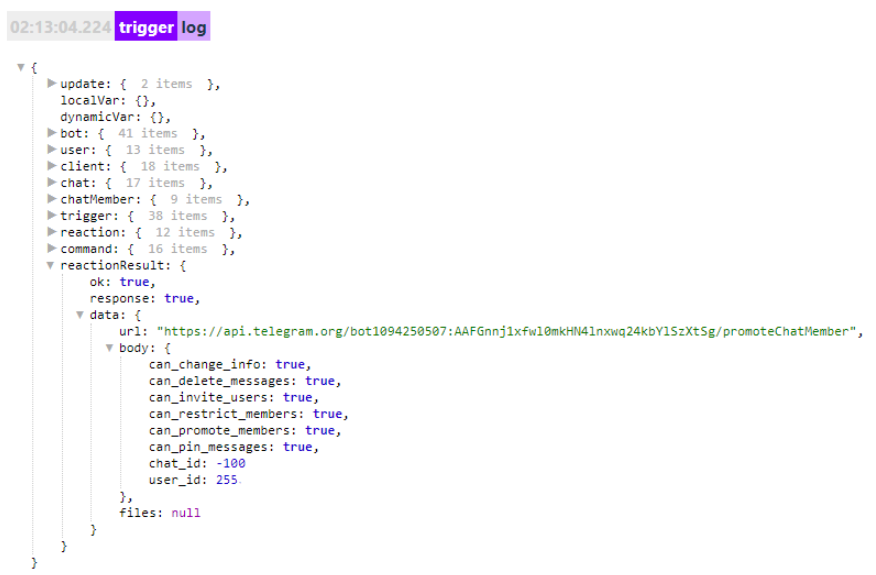
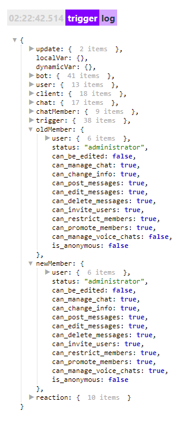

# promoteChatMember

**promoteChatMember** - реакция позволяет выдавать права администратора в чате от имени бота, а так же изменять и забирать права у админов, назначенных ботом.

**В логах реакция примененная в чате выглядит следующим образом:**

* **can_change_info** - разрешение менять профиль чата (фото, био, и прочее)
* **can_delete_message** - разрешение удалять сообщения других участников чата
* **can_invite_users** - разрешение приглашать участников чата
* **can_restrict_members** - разрешение ограничивать (исключать и банить) участников чата
* **can_promote_members** - разрешение назначать в админы участников чата
* **can_pin_message** - разрешение закреплять сообщения в чате

**В логах реакция примененная в канале выглядит следующим образом:**

✔️ — возможно изменить (есть в управлении канала)

➖ - невозможно изменить (отсутствует в управлении канала)
* ➖**can_be_edited** — разрешение редактировать сообщения
* ➖**can_manage_chat** — разрешение управлять чатом
* ✔️**can_change_info** — разрешение изменять профиль канала 
* ✔️**can_post_messages** — разрешение публиковать посты в канале 
* ✔️**can_edit_messages** — разрешение редактировать чужие посты в канале 
* ✔️**can_delete_messages** — разрешение удалять чужие публикации в канале
* ✔️**can_invite_users** — разрешение добавлять пользователей в канале (лимит Телеграма до 200 первых подписчиков) 
* ➖**can_restrict_members** — разрешение управлять пользователями
* ✔️**can_promote_members** — разрешение назначать админов в канале
* ✔️**can_manage_voice_chats** — разрешение управлять голосовым чатом в канале (запускать и останавливать)
* ➖**is_anonymous** — анонимность

