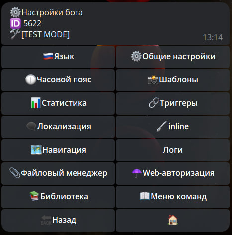

# Библиотека скриптов

♒️Библиотеки скриптов могу быть полезны в тех случаях, когда вам необходимо один и тот же кусок кода использовать в разных реакциях ⚡️`runScript`. Чтобы не дублировать один и тот же код в разных местах, вы можете создать ♒️Библиотеку скриптов, которая по сути является обычным javascript кодом. После создания библиотеки, вы можете использовать код написанный в ней в других ваших скриптах.

Откройте раздел ⚙️Настройки бота - ♒️ Библиотека скриптов:



И нажмите кнопку Создать♒️, чтобы создать новую библиотеку:
* На первом шаге бот попросит указать название библиотеки. Указывать можно название состоящее только из символов английского языка, цифр и символа "_", при этом название не может начинаться с цифры. Напишите название, например **weekDaysLib**.
* На втором шаге напишите javascript-код вашей библиотеки, а затем в конце укажите какие функции и переменные вы хотите экспортировать, записав их в объект `module.exports`. Например, так:
```js 
const short = ['Вс', 'Пн', 'Вт', 'Ср', 'Чт', 'Пт', 'Сб'];
function getShort(dayNum) {
 return short[dayNum];
}

const normal = [
 'Воскресенье',
 'Понедельник',
 'Вторник',
 'Среда',
 'Четверг',
 'Пятница',
 'Суббота'
];
function getNormal(dayNum) {
 return normal[dayNum];
}

function testLib(num) {
  console.log("test", num);
}

module.exports = {
 short: getShort,
 normal: getNormal,
}
```

Эта функция возвращает сокращенное и обычные названия дней недели по их номеру. Обратите внимание, после импорта этой библиотеки, вы сможете вызывать только те функции, которые вы записали в объект `module.exports`, например функция `testLib` не экспортирована и, следовательно, вы не сможете её использовать в других скриптах.

Чтобы воспользоваться этой библиотекой функций, вы можете в реакции ⚡️`runScript` указать следующий код:
```js 
// импортируем нашу библиотеку с именем weekDaysLib
var weekDays = require("weekDaysLib");

var date = new Date();
var dayNum = date.getDay();
// вызываем функцию из нашей библиотеки
var name = weekDays.normal(dayNum);
console.log("Текущий день недели: "+name)
```

Во второй строчке мы импортируем нашу библиотеку воспользовавшись функцией  `require(...)`, и указав этой функции название нашей библиотеки `"weekDaysLib"`. 

